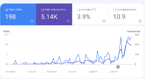

2021년 11월 말부터 블로그 작성을 시작하여 어느덧 3개월 정도가 지난것 같다.

원래는 `Velog` 에 강의를 듣고 이를 정리하는 식으로 진행하고 있었지만,

문뜩 든 생각이, 

- '이걸 누가 못하는가?'
- '저작권 법에 정말 문제가 없는가?' 
- '나에게 어떠한 방식으로 성장의 밑거름이 되었는가?'

정도가 있었다.  결론은, 강의를 듣고 정리하는 글들은 이미 잘하시는 분들도 많고,   나는 단순히 `이승환의 개발블로그` 라는 타이틀을 가지고
강의 정리 내용으로 내 블로그의 정체성을 정하고 싶지 않았다.

--- 

저작권법에 관해서는 이미 다른분들도 충분히 알아보고 괜찮다고 하시는 분들도 많았지만 개인적으로는 강의자가 어떠한 문제에 대해 해결책을 내리고 이를 이용하여
수익창출을 함에도 불구하고 `똑같은` 내용을 원작자의 동이 없이 그대로 다른이에게 무단으로 해당 강의자의 견해를 전달하는 블로그가 되고싶지 않았다.

단순히 강의에대한 정리를 쓰는 행위자체가 나의 성장에 어떻게 도움을 주었는가에 대한 질문은 물론 해당 과정에서 더욱 머리에 정리되는 느낌이 들었고,
실제 배운 내용을 기반으로 글을 씀으로써 새로운 궁금증이 생기는 긍정적 효과가 있었지만, 위와같은 이유로 강의 내용이 빽빽히 찬 블로그를 만들고 싶지는
않았다.

---

그후, 나름 나만의 방법으로 새로운 블로그에 새 출발을 하기로 결정하였다. 

글을 쓸때, 아래와 같은 프로세스를 통해 작성하기로 결심하였다.

- 공부 혹은 프로젝트중 항상 새로운 궁금증, 문제에 직면한다.
- 해당 궁금증을 해결하거나 문제를 해결하기위해 구글링을 통해 여러 사람의 의견 및 자료를 추합하여 나만의 해답을 내놓는다.
- 글을 쓸때, 서론, 본론, 결론에 의거하여 왜 이런 문제에 직면했는가, 어떤 해결방법 혹은 원리가 들어갔는가, 그래서 결론은 무엇인가? 에 꼭 입각하여 작성한다.

하지만 이렇다보니 미천한 나의 실력에 비해 내 견해가 너무 많이 뭍을 수 있는 글을 쓰기 시작하였고, 과연 이런 성질의 글을 사람들이 봐줄까..? 라는 생각이 들며 
글을 쓰고 있었다.

하지만 예상과 달리 생각보다 실제 지표는 가파른 상승세를 보여줬고 단 한분이라도 내 글을 읽어주면 좋겠다
라는 생각과 달리 꽤 많은분들이 내 글들을 읽어주셨다.

비록 자주는 못하더라도 멈추지 않고 계속 공부를 이어나가며 글들을 쓸 계획이다.
