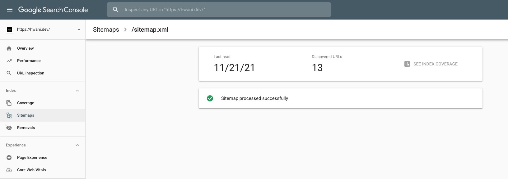
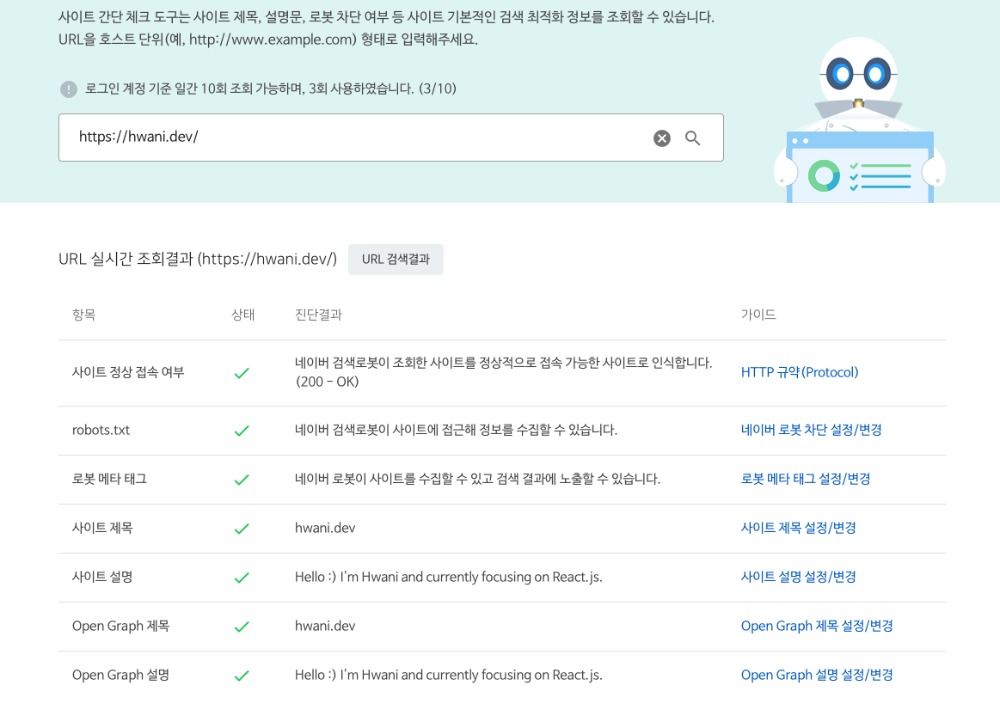

## SEO 란? 

SEO 는 `Search Engine Optimization` 의 약자로써, 구글 등 여러 Search Engine 의 상위 노출을 위한 

검색엔진 최적화이다.

---
## 과정

SEO 를 위해

```javascript
const SEO = ({ title, description, url }) => {
  return (
    <Helmet>
      <title>{title}</title>
      <meta property="og:url" content={url} />
      <meta property="og:title" content={title} />
      <meta property="og:image" content={`${siteUrl}/og-image.png`} />
      <meta name="google-site-verification" content="hidden" />
      {description && <meta name="description" content={description} />}
      {description && <meta property="og:description" content={description} />}
    </Helmet>
  )
}
```

위와 같이 필요한 정보들을 입력해주었고, `Google Search Console` 에서 데이터 분석 및, 동작이 제대로 되는지에 대한 

`tracking` 정보를 위해, `google-site-verification` 또한 추가해주었다.

```xml
<?xml version="1.0" encoding="UTF-8"?>
<urlset xmlns="http://www.sitemaps.org/schemas/sitemap/0.9" xmlns:news="http://www.google.com/schemas/sitemap-news/0.9" xmlns:xhtml="http://www.w3.org/1999/xhtml" xmlns:mobile="http://www.google.com/schemas/sitemap-mobile/1.0" xmlns:image="http://www.google.com/schemas/sitemap-image/1.1" xmlns:video="http://www.google.com/schemas/sitemap-video/1.1">
<url> <loc>https://hwani.dev/about-hoodie-kr/</loc> <changefreq>daily</changefreq> <priority>0.7</priority> </url>
<url> <loc>https://hwani.dev/quick-start-kr/</loc> <changefreq>daily</changefreq> <priority>0.7</priority> </url>
<url> <loc>https://hwani.dev/writing-guide-kr/</loc> <changefreq>daily</changefreq> <priority>0.7</priority> </url>
<url> <loc>https://hwani.dev/other-tips-kr/</loc> <changefreq>daily</changefreq> <priority>0.7</priority> </url>
<url> <loc>https://hwani.dev/no-var/</loc> <changefreq>daily</changefreq> <priority>0.7</priority> </url>
<url> <loc>https://hwani.dev/no-global/</loc> <changefreq>daily</changefreq> <priority>0.7</priority> </url>
<url> <loc>https://hwani.dev/starbucks-menu-1/</loc> <changefreq>daily</changefreq> <priority>0.7</priority> </url>
<url> <loc>https://hwani.dev/series/gatsby-starter-hoodie-로-블로그-시작하기</loc> <changefreq>daily</changefreq> <priority>0.7</priority> </url>
<url> <loc>https://hwani.dev/series/JS_CleanCode</loc> <changefreq>daily</changefreq> <priority>0.7</priority> </url>
<url> <loc>https://hwani.dev/</loc> <changefreq>daily</changefreq> <priority>0.7</priority> </url>
<url> <loc>https://hwani.dev/search/</loc> <changefreq>daily</changefreq> <priority>0.7</priority> </url>
<url> <loc>https://hwani.dev/series/</loc> <changefreq>daily</changefreq> <priority>0.7</priority> </url>
<url> <loc>https://hwani.dev/tags/</loc> <changefreq>daily</changefreq> <priority>0.7</priority> </url>
</urlset>
```



또한, `sitemap` 을 작성하고 제출하여, 정상적으로 search engine 이 나의 `sitemap` 을 참고하도록 설정해주었다.

```txt
User-agent: *
Allow: /
Sitemap: https://hwani.dev/sitemap/sitemap-index.xml
Host: https://hwani.dev

```

마지막으로는 Robot.txt 파일 또한 수정하고, `Root` 디렉토리에 위치하게 하였다.

---

## 결과



네이버를 통한 SEO 간단 체크 결과 모든 항목이 정상적으로 체크되어있었다.

하지만 SEO 부분에서는 아직 모르는 것 투성이고 아직 improved 시킬 수 있다는 판단이 섰다.

추가 사항이 있다면, 추가적으로 연재할 계획이다! 

---

## Reference

<a href="https://neilpatel.com/what-is-seo/" target="_blank">What Is SEO? (Learn How to Do It in 5 Minutes)</a>

