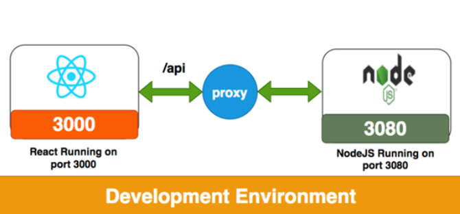

## 서론

평소 프로젝트를 진행할때,

리액트를 사용한 Client 단만을 만들었는데, 나는 Express.js 에 대한 이해가 어느정도 있긴 하였다.

하지만 항상 느꼈던 점은 어떻게 Server(Node.js) 단과, Client(React ) 단을 동시에 연결할지를 몰랐었고, 알게된 과정을 기록하려 한다.

---

## 본론

###내가 사용한 모듈 : 
 - Express
 - nodemon
 - cocurrently
 - react
 - http-proxy-middleware
 
##### Express :

`Express`란 Node.js를 사용하여 쉽게 서버를 구성할 수 있게
만든 클래스와 라이브러리의 집합체 이다.

##### nodemon:

`nodemon`이란 Node.js에 기반한 웹 어플리케이션을 개발할 때, 파일에 변경사항이 발생했을 때마다, 저절로 어플리케이션이 재실행되도록
도와주는 패키지이다. 

##### cocurrently:

`cocurrenly`란 명령어를 동시에 실행시켜주는 모듈이다.

##### http-proxy-middleware:

`http-proxy-middleware`란 여러 개의 프록시를 등록하고 옵션을 줄 때 편리하게 도와주는 모듈이다.



---

### 디렉토리 생성 및 필요 모듈 설치

```
$ mkdir my-app
$ cd my-app
$ echo node_modules > .gitignore
$ npm init -y
$ npm install express nodemon concurrently
```

서버로 사용할 `index.js` 파일을 생성 후 아래 내용을 입력해준다.

```javascript
// express 모듈 불러오기
const express = require("express");

// express 객체 생성
const app = express();

// 기본 포트를 app 객체에 설정
const port = process.env.PORT || 5000;
app.listen(port);

// 미들웨어 함수를 특정 경로에 등록
app.use("/api/data", function (req, res) {
  res.json({ greeting: "Hello World" });
});

console.log(`server running at http ${port}`);
```

루트 디렉토리의 `package.json` 파일에 아래의 script 를 추가해준다.

```javascript
"scripts": {
  "start": "nodemon index.js"
}
```

### CRA 를 사용한 Client단 생성 및 초기화

```
$ create-react-app client --use-npm --template typescript
```

### 프록시 설정

`client` 디렉토리로 이동하여 `http-proxy-middleware` 를 설치한다.

```
$ cd client
$ npm install http-proxy-middleware
```

설치 후 `/client/src` 디렉토리에 `setupProxy.js` 파일을 생성 후 아래의 내용을 작성한다.

```javascript
const { createProxyMiddleware } = require("http-proxy-middleware");

module.exports = function (app) {
  app.use(
    createProxyMiddleware("/api/data", {
      target: "http://localhost:5000",
      changeOrigin: true,
    })
  );
};
```

### 서버(Express), 클라이언트(React) 동시 시작 설정

루트 디렉토리의 `package.json` 의 스크립트를 다음과 같이 수정한다.(cocurrently 사용)

```
"scripts": {
  "start": "nodemon index.js",
  "dev": "concurrently \"npm run dev:server\" \"npm run dev:client\"",
  "dev:server": "npm start",
  "dev:client": "cd client && npm start"
}
```

### 검색 폼 및 리스트 추가(임시 컴포넌트)

`/client/src/` 디렉토리에 components 폴더를 생성하고 SearchForm.tsx, SearchList.tsx 파일을 생성하고 각각 아래처럼 입력해 준다.

#### SearchForm.tsx

```javascript
const fetchApi = () => {
  fetch('api/data')
    .then((res) => {
      return res.json();
    })
    .then((data) => {
      console.log(data);
    });
};

const SearchForm = () => {
  return (
    <div className="form">
      <input type="text" className="form-text" />
      <button type="button" className="form-btn" onClick={fetchApi}>
        search
      </button>
    </div>
  );
};

export default SearchForm;
```

#### SearchList.tsx

```javascript
import React from "react";

const SearchList = () => {
  return (
    <div className="card-list"></div>
  );
};

export default SearchList;
```

App.tsx 변경

```javascript
import React from "react";
import SearchForm from "./components/SearchForm";
import SearchList from "./components/SearchList";

function App() {
  return (
    <div className="App">
      <SearchForm />
      <SearchList />
    </div>
  );
}

export default App;
```
`search` 버튼을 클릭하면 `fetch` 함수로 `서버(http://localhost:5000/api/data)`에 요청을 하게 되고 응답값으로 콘솔창에 `{ greeting: "Hello World" }`가 출력되는 것을 확인할 수 있다.


---


