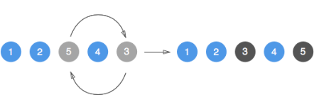

## 서론

<iframe src="https://giphy.com/embed/xUA7b0Klw8Wfor7FWo" width="480" height="360" frameBorder="0" class="giphy-embed" allowFullScreen></iframe><p><a href="https://giphy.com/gifs/loop-play-colors-xUA7b0Klw8Wfor7FWo"></a></p>

Node.js 를 사용해 `버블 소트(bubble sort)` 와 같은 알고리즘을 공부하거나 일반적인 `.sort()` 메서드를 사용할때도 종종 두 원소를 
비교하여 조건문이 `참(true)` 라면 순서를 바꿔야 (swap) 하는 상황이 종종 생긴다.



두 원소의 `순서를(index)` 바꾸는 행위를 `스와핑(swapping)` 이라 부르는데, 스와핑은 언어에 따라, 성능에 따라, 또한 개개인의 편의 및 선호도에 따라 적용할 수 있는 많은 방법이 있다.

본고에서는 JavaScript 에서 스와핑을 할 수 있는 3가지의 방법인 `임시 변수 활용(using temporary virable)`, `구조 분해(desctructuring) 활용`, `splice() 메서드 활용` 을 다룰것이다.

---

## 본론

### 1. 임시 변수 활용(using temporary variable)

임시 변수를 활용하여 원소의 순서를 바꿀 때, 세가지의 스텝만 기억하면 된다.

- 첫번째 스텝은 스와핑할 첫번째 원소를 담을 임시 변수를 `선언(declaration)` 후 `할당(assignment)` 하고,
- 두번째 스텝으로는 첫번째 원소의 공간에 두번째 원소의 값을 `재할당(reassignment)` 해준다. 
- 마지막 스텝으로는 기존 배열의 첫번째 원소 값을 담고 있던 임시 변수를 배열의 두번째 인덱스에 `재할당` 해주면 비로소 스와핑이 이루어진다.

```js
const myArray = [1, 3, 5, 7, 10];

const tmpVar = myArray[0];
myArray[0] = myArray[1];
myArray[1] = tmpVar;

console.log(myArray); // [3, 1, 5, 7, 10]
```

위와 같은 방법으로도 가능하지만 위의 로직을 `함수(functionalizaiton)` 시켜 `재사용성(reusability)` 을 크게 향상시킬 수 있다.

```js
const elSwapFunc = (arr, idx1, idx2) => {
  const tmp = arr[idx1];
  arr[idx1] = arr[idx2];
  arr[idx2] = tmp;
};

const myArr = [1, 2, 3, 4, 5];
elSwapFunc(myArr, 0, 1);
console.log(myArr); // [2, 1, 3, 4, 5]
```

얼핏보면 아무값도 리턴하지 않고 함수 내부에서 스와핑이 이루어지기에 이게 가능한가..? 라는 생각을 할 수 있지만,
JavaScript 의 특성상 인자를 통해 함수에 배열을 전달할 때 값이 아닌 `실제 메모리 주소` 를 전달하기에 원본 배열이 변경된다 `(side effect)` .  


### 2. 구조 분해(desctructuring) 활용

구조 분해를 활용하여 스와핑을 진행할 수 있다면 위에 기술한 방법보다 더욱 간단히 한줄만을 사용하여 표현할 수 있다.

단순하게 순서에 맞게 새로운 배열을 만들고, 반대의 순서를 가진 새로운 배열을 할당하면 된다.

```js
const myArray = [1, 2, 3, 4];

[myArray[1], myArray[0]] = [myArray[0], myArray[1]];

console.log(myArray); // [2, 1, 3, 4]
```

위의 로직 또한 함수화를 통해 재사용성을 높일 수 있다.

```js
const swapElFunc = (array, index1, index2) => {
  [array[index1], array[index2]] = [array[index2], array[index1]];
};

const myArray = [1, 2, 3, 4, 5];
swapElFunc(myArray, 0, 1);
console.log(myArray); // [2, 1, 3, 4, 5]
```

### 3. `.splice()` 메서드 활용

`Array.prototype.splice()` 메서드는 mdn 공식문서에 따르면 아래와 같이 나온다.

> The splice() method changes the contents of an array by removing or replacing existing elements and/or adding new elements in place. To access part of an array without modifying it, see slice().
> - MDN

해석하자면 `splice()` 메서드는 배열의 내부 원소를 제거하거나 대체하거나 원소를 추가할때 쓰인다.
원본 배열을 훼손하지 않고 배열의 일정 부분에 접근하려면 `slice()` 메서드를 사용하라고 말한다.
활용법은 이해하기 쉽지만 주요한 점은 `splice()` 메서드는 원본 배열을 변경/회손 한다. 즉, `불변성(immutability)`을 지키주지 않는다.

기본적인 문법은 아래와 같다.

```js
array.splice(index, howmany, element1, ....., elementX)
// (영향을 줄 start 인덱스, 몇개의 인덱스(삭제), 추가 할 인덱스)
```

하나의 원소를 제거 && 대체 해야한다면 아래와 같이 사용할 수 있다.

```js
const myArray = [12, -2, 55, 68, 80];

// 제거 
myArray.splice(1, 1);
console.log(myArray); // 12,55,68,80]

// 대체
myArray.splice(1, 1, 444);
console.log(myArray); // 12,444,68,80]
```

본론으로 돌아가 `splice()` 를 이용한 스와핑은 아래와 같이 진행할 수 있다.

```js
const myArray = [12, -2, 55, 68, 80];

myArray[0] = myArray.splice(1, 1, myArray[0])[0];

console.log(myArray); // [-2,12,55,68,80]
```

함수화를 하면 아래와 같다.

```js
const swapElements = (array, index1, index2) => {
    myArray[index1] = myArray.splice(index2, 1, myArray[index1])[0];
};

const myArray = [12, -2, 55, 68, 80];
swapElements(myArray, 0, 1);
console.log(myArray); // [-2,12,55,68,80]
```

---

## 결론

JavaScript 에서 스와핑을 할수 있는 많은 방법이 있지만, 
ES6 구조분해를 사용하는 방법이 난의도상으로도, 가독성면으로도 나에게는 제일 잘 맞는다고 생각한다.


