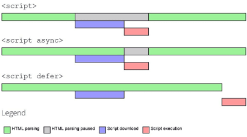

## 서론

일반적으로 나는 보통 Vanilla JS 로 프로젝트를 진행할때 <br>
`<script>` 태그를 사용하여 
`HTML` 파일에 `Javascript` 파일을 <br> `import` 하는 방식을 일방적으로 떠올렸다. <br> 
하지만, 보통 `<head>` 태그 내부에 <br>
```html
<!DOCTYPE html>
<html lang="ko"
      <head>
        <meta charset="UTF-8" />
        <title>이승환</title>
        <script src="app.js"></script>
      </head>
</html>
```
위와 같이 일반적인 방법으로 쓰곤 하였는데, 이때 브라우저의 동작방식은 <br>
"엔진 자체가 위에서부터 `HTML` 을 `parsing` 하다가 `script` 태그를 만나면, <br>
HTML 의 Parsing 을 잠시 멈추고 `JS` 파일을 `fetching`  후 `execute` 한다." <br>

정도인 것으로 알고 있었다. 이를 단순하게 보면, <br>

`parse HTML` => <br>
`HTML parsing temporarily blocked` => <br>
`fetch js` => <br>
`execute js` => <br>
`continue parsing HTML` => <br>
`Done!!` <br>

라고 생각할 수 있다. <br>
이때 만일 해당 `web application` 이 `js file` 에 <br>
지나치게 많이 의존하고 있는 상황이거나, 인터넷의 속도가 느려 js file 의 `fetching` 및 
`executing process` 시간이 길어지면 사용자는 아무 화면조차 볼 수 없는 상황에 직면할 수 밖에 없다.

이에따른 해결점에 대해 구글링을 해보았다.

---

## 본론

### body 내부에 script 태그 작성

```html
<!DOCTYPE html>
<html lang="ko"
      <head>
        <meta charset="UTF-8" />
        <title>이승환</title>
      </head>
      <body>
        <p>이승환입니다</p>
        <script src="app.js"></script>
      </body>
</html>
```

그렇다면 `body` 태그 내부에, 또한 `최하단에` `script` 태그를 사용하는 방식을 <br>
고려해 볼 수 있다. 이때의 웹브라우저의 동작 방식을 생각해본다면,

`parse HTML` => <br>
`when HTML is all ready then fetch js` => <br>
`execute js` => <br>
`Done!!`

위와 같이 HTML parsing 이 끝나면, <br>
js fetching 을 시작하고, 해당 작업이 끝나면, <br>
js file 을 실행한다.

이때, 인터넷이 느린 사용자는 긴 시간을 기다릴 필요 없이 <br>
비교적 짧은 시간안에 페이지를 볼 수 있지만, <br>
문제는 사용자의 `action` 이 `js file` 과 깊은 연관성이 있거나,
요소의 `styling` 이 `js` 로 이루어져 있다면, <br>
그야말로 빈 껍대기 뿐인 화면을 보는 상황에 직면하게 된다는 점이다.

### head 태그 내부에 async 를 사용

```html
<!DOCTYPE html>
<html lang="ko"
      <head>
        <meta charset="UTF-8" />
        <title>이승환</title>
        <script async src="app.js"></script> //async
      </head>
      <body>
        <p>이승환입니다</p>
      </body>
</html>
```

`head` 태그 내부에, `async` 를 사용하여 `js file` 을 `import` 한다면, <br>
웹 브라우저의 동작 방식은

`parse HTML & fetch js` => <br>
`when js is all fetched block HTML parsing and execute js` => <br>
`continue parsing HTML` => <br>
`Done!` <br>

위의 방식을 설명하자면, <br>
초기 `HTML` 을 `parsing` 하다 `async` property 가 붙은 `script` 태그를 발견하면,
`병렬적으로` `HTML parsing` 과 `js fetching` 을 `동시에` 한다. <br>
그후, `js fetching` 이 끝난다면, `HTML parsing` 을 멈춘뒤 `js file` 을 실행한다. <br>
이후에 마지막으로 멈췄던 `HTML parsing` 을 지속한다.

뭔가 프로세스 자체가 굉장히 혁신적으로 병렬적 처리를 하며, 완벽해 보이지만, 
이 방식은 HTML parsing 이 끝나기도 전에, js file 이 실행되므로, js file 이
HTML DOM 요소를 컨트롤 하는 코드가 있다면, 이는 실행되지 않거나 에러를 유발할 수 있다.

더 이상적인 방식은 없을까?

### head 태그 내부에 defer 를 사용

```html
<!DOCTYPE html>
<html lang="ko"
      <head>
        <meta charset="UTF-8" />
        <title>이승환</title>
        <script defer src="app.js"></script> //defer
      </head>
      <body>
        <p>이승환입니다</p>
      </body>
</html>
```

`head` 태그 내부에, `defer` 를 사용하여 `js file` 을 `import` 한다면, <br>
웹 브라우저의 동작 방식은

`parse HTML & fetch js` => <br>
`when HTML is all parsed execute js` => <br>
`Done!` <br>

일단 한눈에 보기에도 process 자체가 확실히 줄었다! <br>
설명을 하자면, `HTML parsing` 을 하던 중 `script defer` 를 만나게 되면,
`병렬적으로` HTML parsing 과 js fetching 을 진행한다. <br>
그후, HTML parsing 이 완료되면, js file 을 실행한다.

이 얼마나, 획기적인 방식인가. 사용자가 아무것도 못보는 시간을 단축하면서도,
js 파일을 병렬적으로 fetching 하면서도, HTML parsing 이 끝나서야 js file 을 실행한다니.


### 위 세개의 방식의 함축



---

## 결론

하다못해 js file 을 import 하는 과정에도 상황에 맞는 방식을 택해야 하며, 고려할 상황이 
꽤 많다는 점을 캐치하게 되었다. 해당 글을 작성했다고 무조건 `defer` 를 써야지! 라고 생각할 것이 아닌,
모든 방식에 각각의 장단점과 동작원리를 알고 사용하는것이 중요하다고 다시 한번 생각한다.
