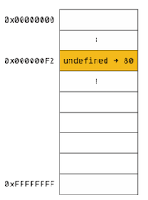
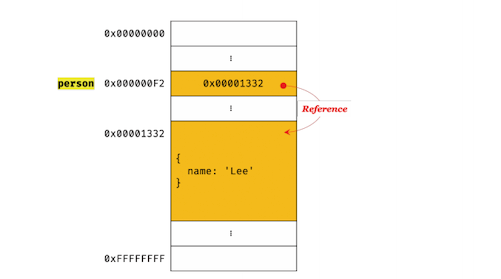

## 서론

```javascript
const num = 1;
num = 2 // Uncaught TypeError: Assignment to constant variable.
```

위의 코드는 자바스크립트를 학습한 사람이라면 누구나 에러를 예상할 수 있는 코드이다.
이유라 하면 변수 `num` 은 const 키워드를 사용한 즉, 변하지 않는 `변수(메모리 공간)` 을 `선언` 후 우항의 표현식에 따른 값(1) 을
`할당` 하였기 때문에 값을 변경할 수 없다.

```javascript
const arr = [];
arr.push('foo');
console.log(arr); // ['arr']
```

아무런 생각없이 평소에 작성하던 위의 예시와 같은 코드에 대해 생각해보다가 정말 머리가 터지고, 자바스크립트에 대해
의구심을 가지기 시작했다. `const` 즉, `constant` 의 줄임말, 한글로 해석하면 `상수`, 상수란 `변하지 않는 값`.
하지만 상수의 값을 바꾸는 코드를 실행했는데 에러가 나지 않았다? 미친듯이 구글링을 하기 시작했다.

---

## 본론

물론 이에 대해 반박하시는 분들의 의견은 거의 일치했고 이에따라 근거는 항상 거의 같았다.

우선 공식문서에 의거하면 

- 상수는 `재할당` 에 의해 변경될 수 없다.
- 상수는 `재선언` 될 수 없다.

결국 cost keyword 를 사용해 선언한 배열(arry) 혹은 객체(object)를 조작하는 행위는,
재할당 및 재선언에 의해 값을 변경하는 것이 아닌, 해당 상수가 가리키고 있는 list 를 수정하는 행위이기에 
맞는 행위이다.

위의 내용은 아래의 그림을 보면 더 이해가 빠르다.





첫번째 그림은 변수 선언 후 원시타입의 값의 할당을 표현한 그림이다. 두번째 그림은 변수 선언 후
객체타입의 값의 할당을 표현한 그림이다.

우선 이 둘의 근본적인 차이는 데이터 타입이다. 원시타입의 값은 실제 메모리에 값이 바로 저장되게 되며, 변수는 
해당 메모리의 주소를 참조한다. 또한, 원시타입의 값은 변경 불가능한 값(immutable value) 이다.
그에반해 두번째 그림을 보게되면 변수가 참조하는 메모리 주소는 실제 값이 저장된 다른 메모리주소를 가리키며 쉽게 말해 
하나의 메모리 주소가 생성이 되는 것이 아니라는 소리다. 실제 값은 객체(참조) 타입의 값이며 이는 변경 가능한 값(mutable value) 이다.

이를 더 풀어보자면, 

```javascript
const num = 1;
num = 2; // Uncaught TypeError: Assignment to constant variable.
```
위의 원시타입의 데이터 값은 실제 하나의 메모리 주소를 참조하고 해당 메모리 주소는 본질의 `값`을 저장하고 있기에,
`상수`의 의미론적으로도 변경이 불가하다.

```javascript
const arr = [];
arr.push('foo');
console.log(arr); // ['arr']
```
하지만 위의 변수(arr)는 한개의 메모리주소을 참조하고 있고 참조하고 있는 해당 메모리 공간은 실제 데이터인 array 타입의 값이 들어가 있다.
'const 로 선언된 변수가 참조하고 있는 메모리 주소가 참조하고 있는 해당 배열의 값' 을 어떻게 변경할 수 있는지에 대해 생각을 해보자면
해당 배열의 값이 변경되어도 실질적으로 `arr` 변수가 참조하고 있는 메모리 공간에는 실제 값을 가지고 있는 메모리 공간을 `참조하는 값` 이 들어있으며,
이는 실질적인 데이터가 변경되어도 바뀌지 않는다.

---

## 결론

머리가 꼬여가던 상황이 겨우 풀어졌다. 
해당 개념을 학습했다 해도, 결국 사람이 이해해야 하는데 이를 `상수` 라는 키워드를 쓰는것은 
진입장벽을 높이는 상황이 아닐까..? 하고 조심스럽게 생각해본다.


