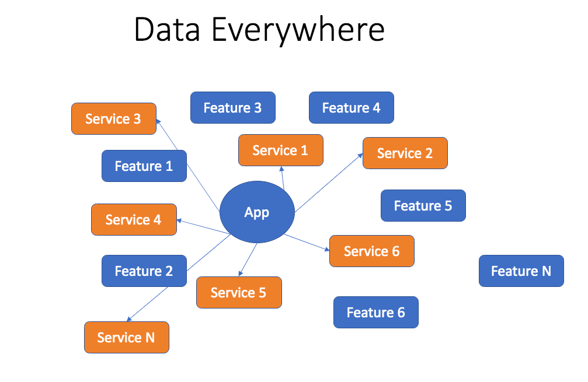

## 서론



https://github.com/woowacourse/javascript-lotto

우아한테크코스 두번째 미션인 `행운의 로또` 미션에서 기존에 콘솔 기반으로 구현한 구조를 UI 와 도메인 여역을 분리 할 수 있는 설계로 
리팩토링하기 위해 고민을 했었다. 그러던 중 element 를 동적으로 생성하여 비출 수 있다면 좋지 않을까 라고 생각했었다. vanilla js 로 이를 구현하기 위해 
필요하다고 생각했던 부분을 정리했었다.

1. element creating system (요소 생성)
- 인자로 필요한 정보를 받아 DOM 요소를 동적으로 생성할 수 있는 시스템이 필요했다. 

2. global state management (전역 상태 관리)

- 동적으로 요소를 생성하면 각각의 요소(component) 는 정보(상태)를 갖게 된다. 하지만 로또 미션에서는 해당 상태를 추합해 결과를 도출해야 했기에, 상태를 
모든 컴포넌트가 읽고/ 쓸 수 있으며 값에 대해 접근할 수 있어야 했다. 또한 전역 상태를 만들지 않으면 결국 모든 상태는 위로 올라가 최상단인 
`controller layer` 가 다뤄야 하며, 책임에 위배된다고 생각했다.

물론 나는 해당 방식을 `사용하지 않았다`. 이유는 생각보다 상황에 맞게 동적으로 컴포넌트의 생성 유무(개수)에 영향을 주는 상황은 구매한 로또의 개수 단 한가지의 경우라 생각했기에
굳이 필요할까? 라는 생각을 했다.

로또를 구매했을 떄, 나머지 컨텐츠가 보이는 등 상황에 맞게 컴포넌트가 되어 화면에 보이게 처리할 수도 있지만, 이는 변화하지 않고 항상 같은 모습을 보여주기에, 
순수하게 CSS로 `display: hidden` 을 적극적으로 이용한다면 문제없이 처리할 수 있다고 생각했다.

그럼에도 불구하고, 위의 이론대로 구현하기 위해 공부하고 시도한 내용을 정리하려 한다. 본고에서는 2번에 해당하는 vanilla js 로 구현한
`global state management (전역 상태 관리)` 를 다룰것이며, 실제 프로덕션 코드가 아닌, 예시 코드를 통해 가능한 간단하게 풀어보려 한다.

---

## 본론

### 구조

```lua
      +----------------+           +---------------+
      |                |           |               |
+---->+   LottoInput   +----+  +-->+   Store (lotto)+-------+
|     |                |    |  |   |               |       |
|     +----------------+    |  |   +---------------+       |
|                           |  |                           |
|     +----------------+    |  |   +---------------+       |
|     |                |    |  |   |               |       |
+---->+      Lotto     +-------+   |     Index     +<------+
      |                |           |               |
      +----------------+           +---------------+

```
- `Index` 파일은 전역상태 공간에 `subscribe(구독)` 을 한다. 변화가 생기면, `Lotto` 컴포넌트를 새로운 데이터와 함께 `re-render` 한다.

- `Store` 객체는 전체적인 global state management를 담당한다. 이는 전역으로 관리할 모든 데이터를 담고있는 `state` object 를 가지고 있다.

- `LottoInput` 컴포넌트는 유저의 로또 번호와 보너스 번호를 캡쳐해 global state store 에 전달한다.

- `Lotto` 컴포넌트는 전역 상태 객체에 있는 값을 렌더한다.


위 구조는 실제 프로덕션 코드가 아니며, 편의상 통계 도출 로직 대신 `Lotto` 컴포넌트를 활용해 전역 상태 값을 보여주기만 하는 예시다.


### index.js

```js
import Lotto from './Lotto.js';
import LottoInput from './LottoInput.js';
import store from './store.js';

const lotto = new Lotto();
const lottoInput = new LottoInput();

store.subscribe('lotto', () => {
  lotto.render();
});

lottoInput.render();
```

### LottoInput.js

```js
class LottoInput {
  constructor() {
    this.state = {
      numbers: [],
      bonus: null
    };
  }

  handleSubmit(event) {
    event.preventDefault();
    const form = event.target;
    const numbers = Array.from(form.querySelectorAll('input[name="number"]'))
      .map(input => Number(input.value))
      .filter(number => number >= 1 && number <= 45 && !isNaN(number))
      .slice(0, 6); 
    const bonus = Number(form.querySelector('input[name="bonus"]').value);
    if (numbers.length === 6 && bonus >= 1 && bonus <= 45 && !isNaN(bonus)) {
      store.setState('lotto', { numbers, bonus });
      form.reset();
    }
  }

  render() {
    const container = document.createElement('div');
    const form = document.createElement('form');
    const inputContainer = document.createElement('div');
    
    for (let i = 1; i <= 6; i++) {
      const input = document.createElement('input');
      input.setAttribute('type', 'number');
      input.setAttribute('name', 'number');
      input.setAttribute('min', '1');
      input.setAttribute('max', '45');
      inputContainer.appendChild(input);
    }
    
    const bonusInput = document.createElement('input');
    bonusInput.setAttribute('type', 'number');
    bonusInput.setAttribute('name', 'bonus');
    bonusInput.setAttribute('min', '1');
    bonusInput.setAttribute('max', '45');
    inputContainer.appendChild(bonusInput);
    form.appendChild(inputContainer);
    
    const submitButton = document.createElement('button');
    submitButton.setAttribute('type', 'submit');
    submitButton.appendChild(document.createTextNode('Buy Lotto Ticket'));
    form.appendChild(submitButton);
    form.addEventListener('submit', this.handleSubmit.bind(this));
    
    container.appendChild(form);
    document.body.appendChild(container);
  }
}

export default LottoInput;
```

### Lotto.js

```js
class Lotto {
  constructor() {
    this.state = {
      numbers: [],
      bonus: null
    };
    store.subscribe('lotto', this.render.bind(this));
  }

  render() {
    const { numbers, bonus } = store.getState('lotto');
    const container = document.createElement('div');
    const numbersText = document.createTextNode(`Numbers: ${numbers.join(', ')}`);
    const bonusText = document.createTextNode(`Bonus: ${bonus}`);
    container.appendChild(numbersText);
    container.appendChild(document.createElement('br'));
    container.appendChild(bonusText);
    document.body.appendChild(container);
  }
}

export default Lotto;
```

### Store.js

```js
class Store {
  constructor() {
    this.state = {};
    this.listeners = {};
  }

  getState(key) {
    return this.state[key];
  }

  setState(key, newState) {
    this.state[key] = {
      ...this.state[key],
      ...newState
    };
    this.notify(key);
  }

  subscribe(key, listener) {
    if (!this.listeners[key]) {
      this.listeners[key] = [];
    }
    this.listeners[key].push(listener);
  }

  unsubscribe(key, listener) {
    if (this.listeners[key]) {
      const index = this.listeners[key].indexOf(listener);
      if (index !== -1) {
        this.listeners[key].splice(index, 1);
      }
    }
  }

  notify(key) {
    if (this.listeners[key]) {
      ...this.listeners[key].forEach(listener => listener());
    }
  }
}

const store = new Store();

export default store;
     

```

위의 `Store.js` 의 로직은 본고의 핵심이 되는 로직이다.
헷갈렸던 로직인 `subscribe`, `unsubscribe`, 그리고 `notify` 메서드에 대해 적어보고자 한다.

- `subscribe` 메서드는 함수(컴포넌트)를 인자로 받아 subscribers 리스트에 추가한다. 쉽게 말해 전역 상태 공간을 
`구독` 한 컴포넌트의 배열에 새로운 함수(컴포넌트)를 추가한다는 뜻이다. 전역 상태가 변경될 때마다, `notify` 메서드를 통해 구독한 컴포넌트들을
새로운 상태(new state)와 함께 re-render 한다.

  
- `unsubscribe` 메서드 또한 함수(컴포넌트)를 인자로 받아 subscribers 리스트에서 제거한다. 이는 더이상 해당 컴포넌트가 전역 상태와 연관이 없는 
컴포넌트가 될 때 사용한다.


- `notify` 메서드는 전역 상태가 바뀔떄마다 호출된다. subscribers(구독한 컴포넌트들) 배열을 순회하며 해당 컴포넌트를 새로운 상태값과 함께 호출한다.
이는 전역 상태 공간을 구독한 컴포넌트들이 상태가 바뀌었는지 알 수 있는 유일한 방법이다.

---

## 마치며

비록 실제 구현한 코드에는 적용하지 못했지만, 최대한 전역 상태 관리를 사용해보고자 하는 과정에서 배운점도, 느낀점도 많은 것 같다.
시간이 있을 떄, 실제 `redux` 가 동작하는 방식처럼 만들어보고 싶은 니즈가 있다.


