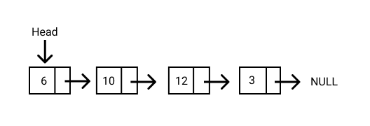
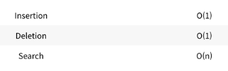

## 서론

`Liked List`란 `배열`과 유사한 선형 데이터 구조이다. 하지만 대표적인 차이로는 배열과 달리 요소가 특정 메모리 위치나 인덱스에 저장되지 않는다.
각 요소는 해당 List 의 다음 객체에 대한 포인터 또는 링크를 포함하는 별도의 객체이다.



각 `요소(Node)`에는 저장된 `데이터`와 다음 노드에 대한 `링크`라는 두 가지의 항목이 포함된다. 
연결 리스트의 진입점을 `헤드(head)`라고 부르고, 헤드는 연결 목록의 첫 번째 노드에 대한 참조이다. 목록의 마지막 노드는 null 을 가리키며, 리스트가 비어있다면,
헤드는 null 을 참조한다. 

보통 메모리를 `연속적으로` 저장하는 배열의 특징으로 인해 배열은 n번째 원소를 접근할 때 바로 접근 할 수 있지만, 메모리 사용이 비효율적이며 배열 내의 잦은 
데이터 추가 및 갓제의 시간복잡도가 O(n)이라는 단점이 존재한다. 반대로 이 글에서 다룰 `linked-list (연결리스트)` 는 메모리를 효울적으로 사용할 수 있고,
삽입, 삭제를 효율적으로 할 수 있다.



---

## 본론

### Linked List 의 장점

- `Linked List` 는 일반적인 `Array` 와 달리 전체 데이터 구조를 재구성 하지 않고도 연결 목록에서 노드를 쉽게 제거하거나 추가할 수 있다.

### Linked List 의 단점

- `Linked List` 에서는 `탐색` 작업이 일반 배열에 비교해 느리다. 또한, 임의 액세스는 허용되지 않으며, 노드는 첫 번째 노드부터 순차적으로 접근할 수 있다.
- 포인터의 저장으로 인해 배열보다 더 많은 메모리를 사용한다.

### Linked List 의 유형

- Singly Linked List (단일 연결 리스트): 각 노드에는 다음 노드에 대한 포인터 하나만 포함된다. 
- Doubly Linked List (이중 연결 리스트): 각 노드에는 다음 노드에 대한 포인터와 이전 노드에 대한 포인터 두 개의 포인터가 포함된다.
- Circular Linked List (순환 연결 리스트): 순환 연결 리스트는 마지막 노드가 첫번째 노드와 그 이전의 다른 노드를 가리키며 루프를 형성하는 연결 리스트의 변형이다.

### Singly Linked List 예시

```js
class Node {
  constructor(value) {
    this.value = value;
    this.next = null;
  }
}

class SinglyLinkedList {
  constructor() {
    this.head = null;
    this.tail = null;
  }

  // 값 찾고 해당 Node 반환
  find(value) {
    let currNode = this.head;
    while (currNode.value !== value) {
      currNode = currNode.next;
    }
    return currNode;
  }

  // 맨 뒤에 Node 생성
  append(newValue) {
    const newNode = new Node(newValue);
    if (this.head === null) {
      this.head = newNode;
      this.tail = newNode;
    } else {
      this.tail.next = newNode;
      this.tail = newNode;
    }
  }

  // 중간에 Node 끼워넣기
  insert(node, newValue) {
    const newNode = new Node(newValue);
    newNode.next = node.next;
    node.next = newNode;
  }

  // Node 삭제
  remove(value) {
    let prevNode = this.head;
    while (prevNode.next.value !== value) {
      prevNode = prevNode.next;
    }

    if (prevNode.next) {
      prevNode.next = prevNode.next.next;
    }
  }

  // Linked List 값 보여주기
  display() {
    let currNode = this.head;
    let displayString = "[";
    while (currNode) {
      displayString += `${currNode.value}, `;
      currNode = currNode.next;
    }
    displayString = displayString.substr(0, displayString.length - 2);
    displayString += "]";
    console.log(displayString);
  }
}
```

### Doubly Linked List 예시

```js
class Node {
  constructor(value) {
    this.value = value;
    this.next = null;
    this.prev = null;
  }
}

class DoublyLinkedList {
  constructor(value) {
    this.head = null;
    this.tail = null;
    this.size = 0;
  }

  printList() {
    const arr = [];
    let currNode = this.head;
    while (currNode !== null) {
      arr.push(currNode.value);
      currNode = currNode.next;
    }

    console.log(arr.join(` <--> `));
    return this;
  }

  // Insert node at the end of the list
  append(value) {
    const newNode = new Node(value);

    if (this.size === 0) {
      this.head = this.tail = newNode;
      this.size++;
      this.printList();
      return this;
    }

    this.tail.next = newNode;
    newNode.prev = this.tail;
    this.tail = newNode;

    this.size++;
    this.printList();
  }

  // Insert node at the start of the list
  prepend(value) {
    const newNode = new Node(value);

    if (this.size === 0) {
      this.head = this.tail = newNode;
      this.size++;
      this.printList();
      return this;
    }

    newNode.next = this.head;
    this.head.prev = newNode;
    this.head = newNode;

    this.size++;
    this.printList();
  }

  // find index of specific node in the list with given index
  getIdxWithVal(value) {
    let idx = 0;
    let currNode = this.head;
    while (currNode !== null && currNode.value !== value) {
      currNode = currNode.next;
      idx++;
    }
    if (currNode !== null) {
      return idx;
    } else {
      console.log(`Node with given val(${value}) doesn\'t exist in the list`);
      throw new Error(
        `Node with given val(${value}) doesn\'t exist in the list`
      );
    }
  }

  // Insert node at a given index
  insert(index, value) {
    if (!Number.isInteger(value) || index < 0 || index > this.size + 1) {
      console.log(`Invalid index. Current length is ${this.size}`);
      throw new Error(`Invalid index. Current length is ${this.size}`);
    }

    // If idx is 0, prepend
    if (index === 0) {
      this.prepend(value);
      return this;
    }

    // Reach to the specific index
    const newNode = new Node(value);
    let prevNode = this.head;

    for (let i = 0; i < index - 1; i++) {
      prevNode = this.head.next;
    }

    const nextNode = prevNode.next;

    newNode.next = nextNode;
    newNode.prev = prevNode;
    prevNode.next = newNode;
    nextNode.prev = newNode;

    this.size++;
    this.printList();
  }

  // Remove a Node
  remove(index) {
    if (!Number.isInteger(index) || index < 0 || index > this.size) {
      console.log("invalid index");
      throw new Error("invalid index");
    }

    // remove head
    if (index === 0) {
      this.head = this.head.next;
      this.head.prev = null;
      this.size--;
      this.printList();
      return this;
    }

    // remove tail
    if (index === this.size - 1) {
      this.tail = this.tail.prev;
      this.tail.next = null;
      this.size--;
      this.printList();
      return this;
    }

    // remove noe at an idx
    let prevNode = this.head;
    for (let i = 0; i < index - 1; i++) {
      prevNode = this.head.next;
    }
    const deleteNode = prevNode.next;
    const nextNode = deleteNode.next;

    prevNode.next = nextNode;
    nextNode.prev = prevNode;

    this.size--;
    this.printList();
    return this;
  }
}

const doublyList = new DoublyLinkedList();

doublyList.append(5);
doublyList.append(16);
doublyList.prepend(1);
doublyList.insert(2, 99);
doublyList.insert(5, 80);
doublyList.remove(doublyList.getIdxWithVal(1));

// 5
// 5 <--> 16
// 1 <--> 5 <--> 16
// 1 <--> 5 <--> 99 <--> 16
// 1 <--> 5 <--> 80 <--> 99 <--> 16
// 5 <--> 80 <--> 99 <--> 16

```

### Circular Linked List 예시

```js
class Node {
  constructor(value) {
    this.value = value;
    this.next = null;
  }
}

class DoublyLinkedList {
  constructor(value) {
    this.head = null;
    this.size = 0;
  }

  printList() {
    if (!this.size) return null;

    const arr = [];
    let currNode = this.head;

    for (let i = 0; i < this.size; i++) {
      arr.push(currNode.value);
      currNode = currNode.next;
    }

    console.log(arr.join(` <--> `));
    return this;
  }

  // Insert node at the end of the list
  append(value) {
    const newNode = new Node(value);

    if (this.size === 0) {
      this.head = newNode;
      this.head.next = this.head;
      this.size++;
      this.printList();
      return this;
    }

    let currNode = this.head;
    while (currNode.next !== this.head) {
      currNode = currNode.next;
    }

    currNode.next = newNode;
    newNode.next = this.head;
    this.size++;
    this.printList();
  }

  // Insert node at the start of the list
  prepend(value) {
    const newNode = new Node(value);

    if (this.size === 0) {
      this.head = newNode;
      this.head.next = this.head;
      this.size++;
      this.printList();
      return this;
    }

    let currNode = this.head;
    while (currNode.next !== this.head) {
      currNode = currNode.next;
    }
    currNode.next = newNode;
    newNode.next = this.head;
    this.head = newNode;
    this.size++;
    this.printList();
  }

  // find index of specific node in the list with given index
  getIdxWithVal(value) {
    let idx = 0;
    let currNode = this.head;
    while (currNode !== null && currNode.value !== value && idx < this.size) {
      currNode = currNode.next;
      idx++;
    }

    if (currNode.value === value) {
      return idx;
    } else {
      console.log(`Node with given val(${value}) doesn\'t exist in the list`);
      throw new Error(
        `Node with given val(${value}) doesn\'t exist in the list`
      );
    }
  }

  // Insert node at a given index
  insert(index, value) {
    if (!Number.isInteger(value) || index < 0 || index > this.size + 1) {
      console.log(`Invalid index. Current length is ${this.size}`);
      throw new Error(`Invalid index. Current length is ${this.size}`);
    }

    // If idx is 0, prepend
    if (index === 0) {
      this.prepend(value);
      return this;
    } else if (index === this.size) {
      this.append(value);
      return this;
    }

    // Reach to the specific index
    const newNode = new Node(value);
    let prevNode = this.head;

    for (let i = 0; i < index - 1; i++) {
      prevNode = this.head.next;
    }

    const nextNode = prevNode.next;

    newNode.next = nextNode;
    prevNode.next = newNode;
    this.size++;
    this.printList();
  }

  // Remove a Node
  remove(index) {
    if (!Number.isInteger(index) || index < 0 || index > this.size) {
      console.log("invalid index");
      throw new Error("invalid index");
    }

    // remove head
    if (index === 0) {
      let currNode = this.head;
      while (currNode.next !== this.head) {
        currNode = currNode.next;
      }
      currNode.next = this.head.next;
      this.head = this.head.next;
      this.size--;
      this.printList();
      return this;
    }

    // remove tail
    if (index === this.size - 1) {
      let currNode = this.head;
      while (currNode.next !== this.head) {
        currNode = currNode.next;
      }
      currNode.prev.next = this.head;
      this.size--;
      this.printList();
      return this;
    }

    let currNode = this.head;

    // remove noe at an idx
    let prevNode = this.head;
    for (let i = 0; i < index - 1; i++) {
      prevNode = this.head.next;
    }
    const deleteNode = prevNode.next;
    const nextNode = deleteNode.next;

    prevNode.next = nextNode;

    this.size--;
    this.printList();
    return this;
  }
}

const doublyList = new DoublyLinkedList();

doublyList.append(1);
doublyList.append(2);
doublyList.prepend(0);
doublyList.insert(2, 99);
doublyList.insert(5, 80);
doublyList.remove(doublyList.getIdxWithVal(1));

// 1
// 1 <--> 2
// 0 <--> 1 <--> 2
// 0 <--> 1 <--> 99 <--> 2
// 0 <--> 1 <--> 80 <--> 99 <--> 2
// 0 <--> 80 <--> 99 <--> 2

```

---


