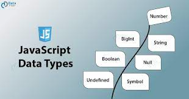
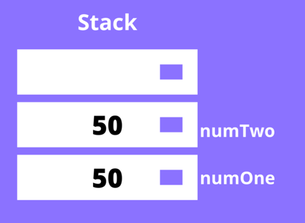
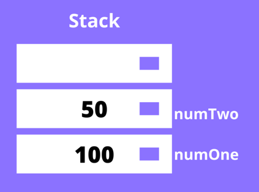
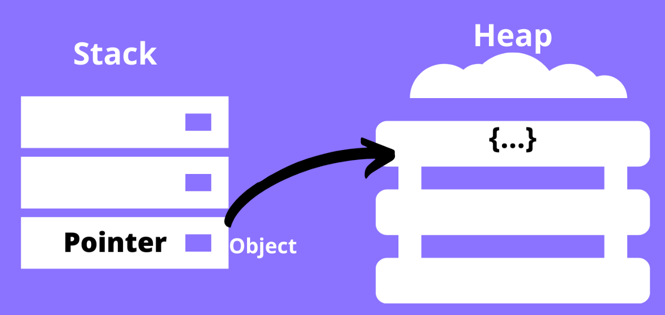
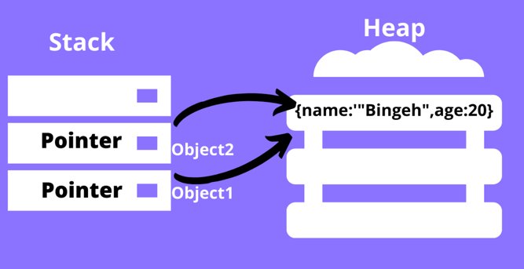

## 서론

<iframe src="https://giphy.com/embed/f16wgrNYaKkBcvOu5r" width="480" height="270" frameBorder="0" class="giphy-embed" allowFullScreen></iframe><p><a href="https://giphy.com/gifs/harlem-f16wgrNYaKkBcvOu5r"></a></p>

`데이터 타입(data type)` 이란 개발을 할때 매일매일 사용하고 무조건적으로 이해해야 하는 개념이라 생각한다.

JavaScript 에서는 데이터 타입을 `두개로` 나눈다. 하나는 `원시(primitive)타입` 이고, 다른 하나는 `참조(reference)` 타입이다.
본고에서는 이 둘의 차이점에 대해 다룰 예정이다.

---

## 본론

### 자바스크립트의 원시(primitive)타입.

자바스크립트의 원시타입으로는 `number`, `bigint`, `string`, `boolean`, `null`, `undefined` 와 `symbol` 총 7 개가 존재한다.
이들의 공통점은은 `object` 가 아니며, 따로 `메서드(method)` 를 가지지 않는다.




하지만 여기서,

> 자바스크립트의 "string 타입" 은 메서드를 가지는데? 그러면 원시타입이 될수 없지 않은가?

라는 생각이 들수 있다.

이는 자바스크립트의 런타임이 아래와 같은 코드를
```js
"tmp".concat();
```

`String` 오브젝트로 생성하기에 메서드를 가질수 있다.

```js
const str = new String('tmp');
```

### 원시타입은 어떻게 작동하는가?

자바스크립트에서 원시타입을 `선언(declare)` 하면, 이는 `스택(stack)` 에 저장된다. 스택이란 `LIFO(Last In First Out)` 구조를 가진 `자료구조(data structure)` 이다. 
저장된 원시타입은 `식별자`를 통해 접근할 수 있고, 원시 데이터와 함께 스택에 저장된다.

```js
const numOne = 50;
const numTwo = 50;
```

위와 같이 같은 값을 가진 두개의 변수가 선언 및 할당되었을 때, `numOne` 이 값과 함께 스택에 푸쉬되고, 그 위에 `numTwo` 가 값과 함께 스택에 푸쉬된다.
같은 값이 있건 말건 전혀 상관없는 두개의 공간이 생성된다.



이때 `numOne` 의 값을 변경한다해도 `numTwo` 에는 전혀 지장이 없다.

```js
let numOne = 50;
let numTwo = numOne;
numOne = 100;
console.log(numOne); // 100
console.log(numTwo); // 50
```



### 자바스크립트의 참조(reference)타입.

자바스크립트의 참조타입 데이터는 원시타입과 다르게 `동적이다(dynamic)`. 다르게 생각하자면 고정된 크기를 가지지 않는다.

대부분은 `객체(object)` 로 치환되며, 그렇기에 `메서드(method)`를 가진다. 예시로는 `array`, `function`, `object`, `date`, 등 많은 참조 타입 데이터가 있다.

### 원시타입과 객체타입의 차이

차이점은 참조타입 데이터를 저장해야할 때 생긴다. 변수를 선언 후 참조타입의 데이터를 할당하려 할때, 값은 해당 변수에 직접적으로 할당되지 않는다.
해당 변수에 저장되는 값은 `메모리에 저장되어 있는 참조타입 값의 주소`이다.



위의 사진을 보면, 두개의 자료구조가 있다. `스택(stack)`과 `힙(heap)`이다. 객체를 선언 및 할당했다고 가정했을 때, 해당 객체는 힙에 저장된다.
그리고 이의 `포인터`는 스택에 저장된다. `포인터`란 해당 객체의 메모리 주소 값을 가리키는 변수이다.

```js
const object1 = {
name: 'hwani',
age: 25
};
const object2 = object1;

// object1 업데이트,
object1.age = 40;

console.log(object2.age); // 40 
```

`object1` 이란 변수를 선언하였고, 객체를 할당하였다. 이후에 아까 원시타입과 같이 `object2` 를 선언 후 `object1` 를 이에 할당하였다.
그렇다면 힙에 새로운 객체가 생성될까? 답은 생기지 `않는다`.

해당 객체가 이미 힙에 존재하는한, `object1` 과 `object2` 는 같은 객체를 가리킨다.

다른 차이점은 `object1` 의 프로퍼티를 업데이트 할때 볼 수 있다. 위의 코드와 같이 콘솔을 찍어보면 object2 의 프로퍼티또한 변경된 사실을 확인할 수 있다.
이는 object1 과 object2 가 힙에 있는 같은 객체를 가리키고 있기에, 서로 영향을 주기 때문이다.



---

## 결론

참조 타입은 서로에게 영향을 줄 수 있으므로, 최대한 이를 상기하며 코드를 짜는것이 중요하다 생각한다.


