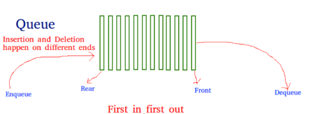

## 서론

`Queue` 는 먼저 온 소비자가 먼저 서비스를 받는 리소스에 대한 소비자 대기열이라 이해하면 편하다. `Queue` 는 `FIFO(선입선출) - First In First Out`
의 특징을 가지고 있다.



---

## 본론


### Queue with normal array 예시

```js
class Queue {
  constructor() {
    this.queue = [];
    this.front = 0;
    this.rear = 0;
  }

  enqueue(val) {
    this.queue[this.rear] = val;
    this.rear++;
  }

  dequeue() {
    const val = this.queue[this.front];
    delete this.queue[this.front];
    this.front++;
    console.log(this.queue);
    return val;
  }

  peek() {
    return this.queue[this.front];
  }

  size() {
    return this.rear - this.front;
  }

  getStr() {
    let str = "[";
    for (let i = this.front; i < this.rear; i++) {
      str += `${this.queue[i]}, `;
    }
    str = str.substr(0, str.length - 2);
    console.log(str + "]");
  }
}

const queue = new Queue();
queue.enqueue(1);
queue.enqueue(2);
queue.enqueue(5);
queue.dequeue();
console.log(queue.size()); // 2
queue.getStr(); // [2, 5]

```

### Queue with Linked List 예시

```js
class Node {
  constructor(val) {
    this.val = val;
    this.next = null;
  }
}

class Queue {
  constructor() {
    this.head = null;
    this.tail = null;
    this.size = 0;
  }

  enqueue(val) {
    const newNode = new Node(val);
    if (this.head === null) {
      this.head = this.tail = newNode;
    } else {
      this.tail.next = newNode;
      this.tail = newNode;
    }
    this.size++;
  }

  dequeue() {
    const val = this.head.val;
    this.head = this.head.next;
    this.size--;
    return val;
  }

  peek() {
    return this.head.val;
  }

  getStr() {
    let str = "[";
    let currentNode = this.head;
    while (currentNode) {
      str += `${currentNode.val} ,`;
      currentNode = currentNode.next;
    }
    str = str.substr(0, str.length - 2);
    console.log(str + "]");
  }
}

const queue = new Queue();
queue.enqueue(1);
queue.enqueue(2);
queue.enqueue(3);
queue.dequeue();
queue.getStr(); // [2, 3]

```


---


