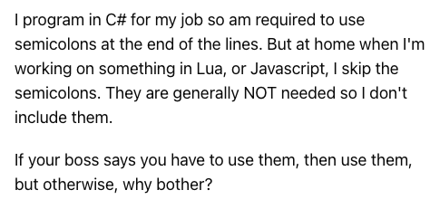

## 서론

자바스크립트 내에서 세미콜론(;) 은 언제 사용해야할까?

왜 사용해야할까? 

언제 사용해야할까?

나는 흔히 인터넷에서 돌아다니는 말중에 '자바스크립트를 사용할때 
세미콜론을 생략해도 되지만, 사용하도록 버릇을 들이는게 좋을것이다.' 
라는 대다수의 조언을 받아드려 마구잡이로 사용하고 있었다.

내가 세운 나만의 기준은 당시 '문장의 끝에 단다.' 정도였지만 조금더 
정확한 이유와 개념을 알 필요가 있다고 생각했다.

---

## 본론

세미콜론(;)은 `문` 의 종료를 나타낸다. 

`문` 이란 프로그램을 구성하는 기본 단위이자 최소 실행 단위이다. 
문의 집합으로 이루어진 것이 `프로그램` 이며, 문을 작성하고 순서에 맞게
나열하는 행위가 `프로그래밍` 이다.

```javascript
const num = 1 + 3;
```

예시로, 위의 내가 생각하던 '문장'은 키워드를 사용한 `변수의 선언`, `표현식의 평가`,`값을 할당`
이 이루어진 하나의 `문` 이다. 즉 자바스크립트는 세미콜론을 기준으로 문이 종료한 위치를 파악 후 순차적으로 하나씩 문을 실행한다.

허나 여기에서 내가 생각하던 문제가 있다. 나는 주로 `ESLint` 와 `Prettier` 같은 정적 분석 도구를 사용하였지만,
보통 문의 종료라고 생각되는 지점에는 자동적으로 세미콜론을 붙여주였지만, `if문`, `for문`, `함수` 뒤에는 세미콜론을 자동으로 붙이지 않아주었다.

나는 여지껏 해당 정적 분석 도구 자체의 하나의 오류이거나 해당 행위는 optional 하지 않을까..? 라고 어림짐작만 하고 있던 상태였다.

하지만, if문, for문, 함수등의 코드 불록 뒤에는 세미콜론을 붙이지 않으며 이유는, 이러한 코드 블록은 언제나 문의 종료를 의미하는
`자체 종결성 (self closing)` 을 가지고 있기 때문이다.

또한, 자바스크립트 엔진은 소스코드를 해석할 때 문의 끝이라고 예측되는 지점에 세미콜론을 자동으로 붙여주는 
`ASI` 가 자동으로 실행되지만 왜 대다수의 개발자들은 세미콜론을 반드시 붙여야한다는 의견이 대다수일까?



위의 한 개발자가 말하기를, C# 을 사용할때는 문의 끝에 반드시 세미콜론을 붙여야한다는 문법적 강제성이 따른다.
하지만 말그대로 자바스크립트에서 런타임 동작시 우리가 붙인 세미콜론은 아무런 의미를 찾을 수 없다는 의견을 내포한다고 나는 이해하였다.

반대로 써야한다는 개발자들의 의견의 대다수는, 보통 다른언어에서도 그래왔기 때문에 `가독성` 면에서 다른이가 나의 코드를 읽었을때,
세미콜론을 사용한다면 해당 문의 끝이 어디인지 정확히 알 수 있기도 하고, 인터프리터의 ASI 기능에 100프로 의존하며 자발적으로 불안감을 느낄 수 있는 행위를 
도대체 왜 옹호하냐는 의견이 많았다.

---

## 결론

세미콜론은 문의 종료를 나타낸다. 문이란 프로그램을 구성하는 기본 단위이자 최소 실행 단위이다. 하지만, 자바스크립트에서는
개발자가 세미콜론을 붙이지 않더라도 ASI 를 통해 자동적으로 문의 끝의 예측지점에 세미콜론을 부여한다.

세미콜론의 사용 비사용 의견에 나의 의견을 말하자면, 결국 우리의 소스코드를 인터프리터가 해석한다고 하지만, 결국 소스코드란
개발자가 쓰고, 유지하고 보수하는 하나의 `문서` 라고 생각이 든다. 그 뜻은, 해당 소스코드를 작성한 개발자 및 해당 소스코드를 
읽고 사용,유지 및 보수해야하는 다른 개발자 또한 지속적으로 해당 소스코드를 보아야 하는데, 인간이 글을 작성할때 가독성을 위해 
문장의 끝에 마침표를 넣듯이, 결국 안정성 및 가독성을 위해 세미콜론을 사용해야 하지 않을까?  

