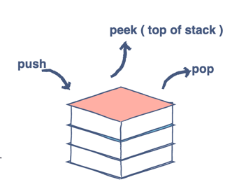

## 서론

거의 모든 응용 프로그램에 존재하는 `되돌리기` 기능의 작동원리나 웹 브라우저에서의 `뒤로가기` 버튼의 작동원리를 추적한다면, 스택이 사용되었을 것이라 짐작한다.
`스택`은 작업의 이정상태를 메모리에 저장하여 마지막 상태가 먼저 나타나게 한다.

---

## 본론

### Stack 의 특징 및 사용 메서드

스택은 기본적으로 `LIFO(후입선출) - Last In First Out` 원리를 따르며 기본적으로 아래의 세 가지의 메서드를 사용한다.

- Push: 스택에 요소 추가
- Pop: 스택에서 요소 제거
- Peek: 스택의 최상위 요소 가져오기



### Stack with normal array 예시

```js
const stack = [];

// Push
stack.push(1);
stack.push(2);
stack.push(3);
console.log(stack); // [1, 2, 3]

// Pop
stack.pop();
console.log(stack); // [1, 2]

// Peek
console.log(stack[stack.length - 1]); // 2

```

### Stack with Linked-List 예시

```js
class Node {
  constructor(val) {
    this.val = val;
    this.next = null;
  }
}

class Stack {
  constructor() {
    this.top = null;
    this.size = 0;
  }

  push(val) {
    const node = new Node(val);
    node.next = this.top;
    this.top = node;
    this.size++;
  }

  pop() {
    const val = this.top.val;
    this.top = this.top.next;
    this.size--;
    return val;
  }

  peek() {
    return this.top.val;
  }

  getSize() {
    return this.size;
  }
}

const stack = new Stack();
stack.push(1);
stack.push(2);
stack.push(3);
console.log(stack.pop()); // 3
stack.push(4);
console.log(stack.pop()); // 4
console.log(stack.pop()); // 2

```


---


