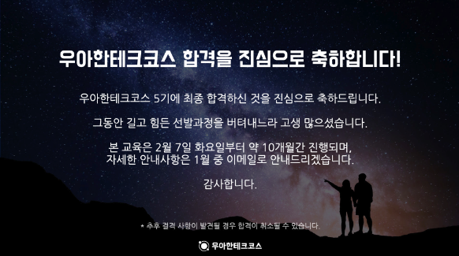
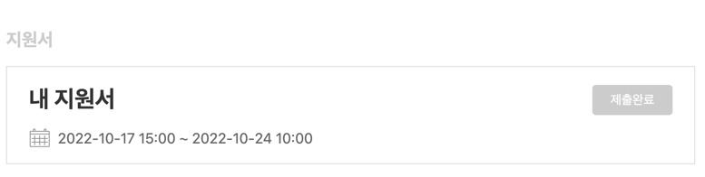
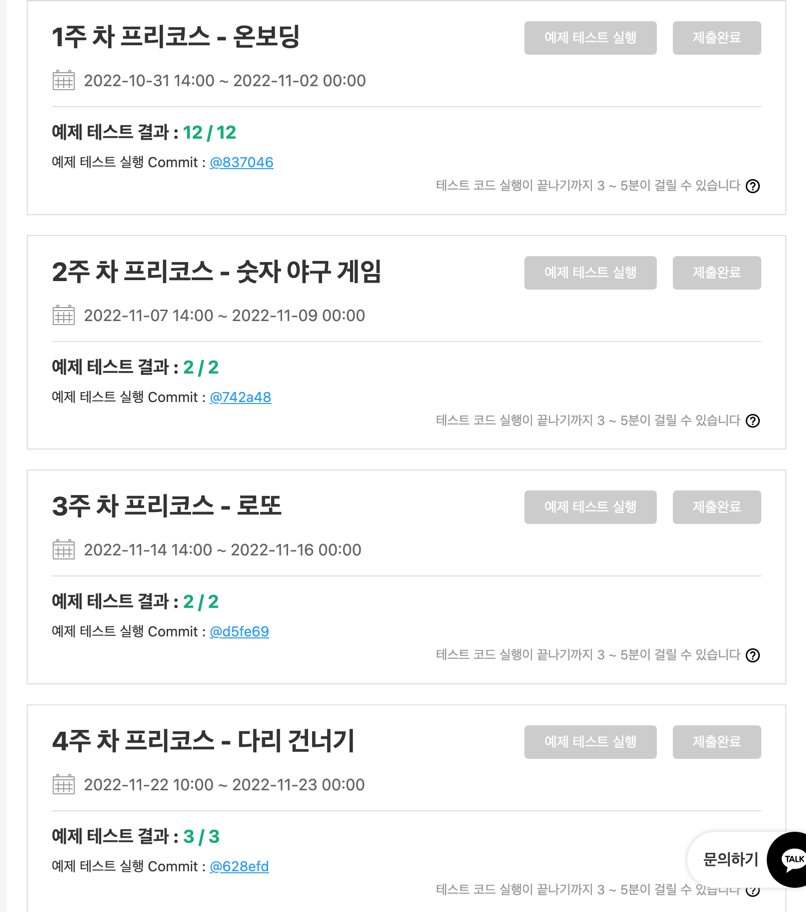
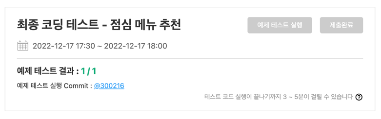

## 서론

비전공자 출신으로 개발자가 되고자 결정한 순간부터 목표로 잡았던 `우아한 테크코스 5기` 에 들어갈 수 있게 되었다. 왜 당장 취업이 아닌 우테코를 목표로 잡았는지에 대한 이유는 여러가지가 있었다.

1. 생각보다 목숨을 걸정도로 몰입하여 프론트엔드 개발자가 되고자 하는 사람이 주위에 많지 않았고, 이에 따라 그러한 사람들과 `같이 몰입하여 성장할 수 있는 환경`에 대한 니즈가 있었다.
2. 메이저 급에 속하는 개발자 양성 기관 중 웹 프론트엔드 코스를 가진 기관은 우테코가 `유일하다`고 생각하였다.  
3. 여지껏 지속적으로 나만의 방향을 잡아 독학으로 학습을 하였지만, 항상 불안감에 가득찬 채 방향을 잡을수밖에 없었고, 이에따라 `등대`와 같이 길을 잡아줄 수 있는 기관에 대한 니즈가 있었다.

---

## 본론

### 1. 지원서 

여러 합격후기에서 말했듯이, 나또한 우테코에 합격하기 위해서는 지원서가 매우 중요하게 작용하는 요소라 생각한다. 우테코는 단순히 개발을 얼마나 잘하는지 역량만을 보지 않고, 지원자가 얼마나 간절한지, 얼마나 폭발적으로 성장할 수 있는지에 대한
종합적 요소를 판단한다고 생각하였다. 이에따라 지원서가 굉장히 크게 작용한다 생각하였고, 같은 계열은 아니지만, 이미 주변에 지원서를 많이 써본 분들과 이미 취업을 한 분들에게 자문을 구하며 나름대로 지원서에서 중요한 요소들을 공부하려 노력하였다.
이를 통해 느낀 중요점들을 나열하려 한다.

#### - 최대한 길게 쓰려 노력했다.

지원서는 보통 문항당 `n자 이내` 라고 명시하는 경우가 많다. 하나를 보면 열을 안다고 자신이 얼마나 합격에 목마른 사람인지를 어필하는 영역에 있어서는 반드시 제한 글자수를 꽉 채우는것이 중요하다 생각했다. 물론 문장을 질질 끄며 일부러 길게 만드는 행동은 피했다.

#### - 가독성을 높히려 노력했다.

선발 프로세스를 진행하는 관계자분들은 하루에 몇개의 지원서를 읽을까? 이번 기수의 프론트엔드 파트 지원자만 해도 1200명 정도 되었던 것으로 기억하고, 이 모든 인원이 지원서를 제출했다. 이에따라 무조건 잘 읽히는 지원서가 유리하다고 판단하였고 이에따라 글의 중심 내용이 글의 첫머리에 오는 형태인
`두괄식` 으로 지원서를 작성해야 한다고 생각하였다. 그리고 최대한 문장들을 간결하게 가져가고자 노력하였다.

#### - 특별한 사람이 되려했다.

지원자 1200명 중 최종합격 인원 50명에 들기 위해서는 얼마나 특별한 사람이라 느껴져야 할까? 합격하기 위해서는, 일관되게 본인을 특별한 사람으로 느껴지게 할 거대한 스토리가 필요하다 느꼈다. 나는 외국에서 중고등학교를 나와 영문학과에 갔지만, 개발자가 되고싶다 생각한 이후로 이를 악물고 독학을 통해 이뤄낸
멋사 회장, 각종 헤커톤 수상 등 최대한 특별한 경험을 녹여내려 노력하였다. 본인을 어필할 수 있을만한 행보와 증거가 없다면 지금부터라도 만들고 도전하는 것이 중요하다 생각하였다.

### 2. 프리코스

나름 취엽시장에 계속 관심을 가지고 분석였고, 주변인들의 후기를 들어볼수록 최근에는 `구현`에 많은 기업들이 점점 초점을 맞춘다고 생각하였다. 5기 지원부터는 처음으로 여지껏 시행되었던 알고리즘 중심의 소위 `코딩 테스트` 가 폐지되었고 해당 부분이 1주차 프리코스에 들어가게 되었다. 7개의 문제가 출제되었으며, 난이도 자체는 
평이했다고 생각하였고 1주일이라는 기간이 주어졌다. 이를 통해 알고리즘 테스트 자체를 4주에 걸쳐 진행될 우테코 선발 프로세스의 `예열` 느낌으로 사용되었다는 느낌을 받았고 실제로는 2주차부터 진행된 문제들에서 `구현`이 중요하게 여겨졌다고 생각하였다. 

앞서 언급한 `구현`은 알고리즘에서 문제 분류에 사용되는 `구현`이 아니다. 이는 언어, 라이브러리, 프레임워크에 대한 깊은 이해를 기반으로 얼마나 주어진 요구사항에 맞추여 정확하고, 가시성이 높고, 효율적인 코드를 정확하게 짤 수 있는지에 대한 능력이라고 생각한다. 실제 프리코스에서는 `vanilla JavaScript` 를 기반으로 
구현을 해야 했으며, 이는 단순히 스택을 넓히고 광범위하게 얕게 공부하기 보다는 `자바스크립트 Deep Dive` 와 다른 책들을 통해 언어에 대해 학습한 시간들이 도움이 많이 되었다.

문제들 또한, 실제 다수의 프로젝트를 진행했던 경험을 통해 마주한 문제들과 해결을 기반으로 구현할 수 있었으므로, 최대한 많은 경험을 통해 준비를 하면 크게 도움이 될것이라 생각한다. 평소에도 `git` 을 최대한 활용하려 노력하고, 커밋 메세지 및 코드에서도 컨벤션을 지키며 `깔끔함`을 우선가치로 놓고 학습한다면 수월할 것이라 예상한다.

### 3. 최종 테스트

지원서와 프리코스를 통해 최종테스트를 치룰 수 있는 기회를 얻는다면, 기존의 프리코스와 유사한 문제를 현장에서 오프라인으로 5시간 내에 구현해야 한다. 기존 1주일의 기간을 투자하여 최선의 코드를 짜려 노력하였지만, 5시간은 처음에는 테스트코드는 커녕 문제에 대한 이해, 구현을 하기에도 빡빡한 시간이라고 생각하였다. 하지만, 그동안 진행했던 
프리코스를 계속 복습하고 전 기수에 진행된 프리코스를 풀며 시간을 단축하려 노력하였다 준비만 되어있다면 문제 난이도 자체는 5시간 내에 구현할 수 있도록 나오기 때문에 충분히 가능하다고 생각한다.

---

## 결론

나는 우테코에 절박했다. 꼭 하고 싶었고 무엇과도 바꿀 수 없다 생각할 정도로 인생에서 큰 기점으로 느껴졌다. 근 1년 기간을 가지고 우테코에 합격할 수 있는 사람이 되기 위해 최선을 다했다고 생각한다. 또한 선발과정은, 물론 헤커톤 경험들이 있지만 방구석에서 갈고닦은 나를 처음으로 현업 종사자분들께 세세하게 평가받는 자리라 생각하여 매우 큰 부담감을 가지고 하루하루를 
보냈다. 나도 여러 지원자분들의 후기를 읽으며 받은 부분이 너무나도 많기에 부족하지만 절박한 심정으로 후기를 찾아다닐 누군가를 도와주고 싶다 생각하였다. 합격하여 너무 행복하고 이제 다시 달릴 준비를 하려한다. 

