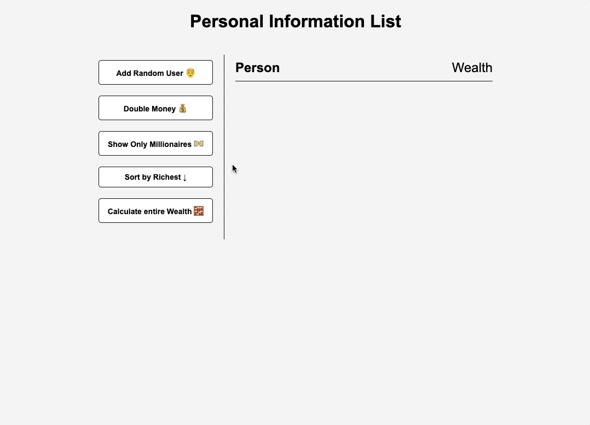

## Intro

5번째 Mini Vanilla Js Project 이다.

이번에는 `Random User Generator-API` 라는 `Third-party api` 를 사용하여 개인자산 체크 기능을 만들어보았다!

---

## Main

- [소스코드](https://github.com/sh981013s/Projects-with-VanillaJs/tree/main/Personal-Information-List)
- [liveDemo](https://hwani-vanillajs.netlify.app/personal-information-list/)

---

## Conclusion

JS 에서 가장 흔하게 사용되는? 메서드인 `sort`, `filter`, `reduce`, 를 주축으로 구현을 해보았다.

간편화를 위해, input 으로 user 정보를 받는것이 아닌, 외부 api 를 사용하여 쉽게 예시 user 를 추가 할 수 있게 했고,

이를 좌축의 aside button 들에 event mapping 해놓았다.

가장 고민했던 부분은, event 가 실행되어 유저가 추가되었을때, 유저의 데이터가 변할때 어떤 방식으로 DOM 자체를 refresh 없이 re-rendering 시킬것인가 였다.

React 는 Virtual DOM 을 사용하여 Diff 를 파악한 후, 변경점이 필요한 부분만 바꾸어주는 방식을 사용하지만, Vanilla JS 로 이를 직접 구현하기에는 나중에 내 기준에서는 (대형..?) 프로젝트 및 과제로 미루어두고,

우선은 state 를 가지고 있는 화면단을 하나의 배열로 관리하며, 해당 state 가 변경될 때, 통째로 re-rendering 하는 방식으로 구현하였다. 

이번에도 느낀것이지만, vanillaJS 프로젝트를 진행할때마다, framework 이 자체적으로 가지고 있는 기능 혹은 library 가 대신 해주었던 기능들을 직접 사소하나마 찾아가며 구현하며 내 프로젝트와의 차이점을 찾고, 해당 framework 이나 library 의 기능들의 작동 방식을 차차 알아갈 수 있다는 점이 아직은 재밌게 느껴졌다!