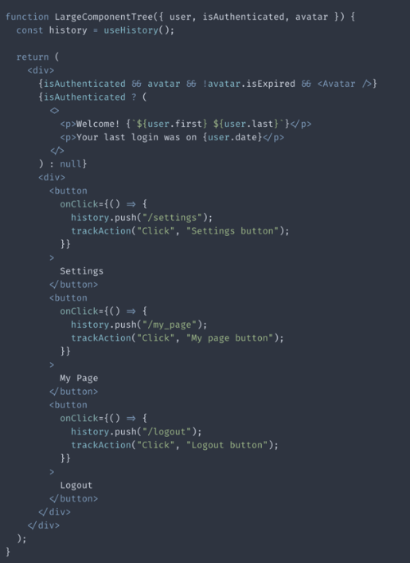
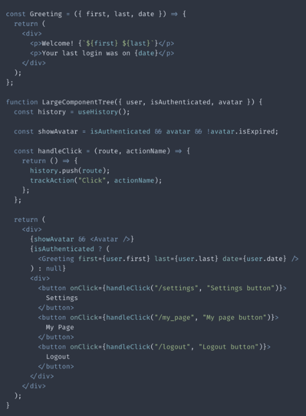
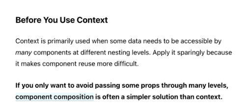

## 서론

항상 나는 리액트라는 `도구`를 올바르게 사용하고 있는지에 대한 고민이 있다.
망치를 가지고 있다고 가정하였을때 망치 손잡이를 잡을지 아니면 망치 머리 가까이에 손을 위치할지 결정할 수 있다. 
망치 제작자들은 방법을 `명시`하지 않지만, 더 `효율적인` 방법은 존재하리라 믿는다. 이는 리액트에도 해당되지 않을까 싶다.


본고에서는 단순히 리액트를 사용한다는 관점을 넘어서 어떻게 더 `효율적으로` 리액트를 사용하기 위하여 피해야하는 세가지의 `안티패턴` 에 대하여 다룰 것이다.


---

## 본론

### 1. 단일 컴포넌트 내부의 거대한 트리 구조 지양

리액트를 처음 시작했을 때 흔히 `구조`와 `구조 정리` 등 많은 부분을 고려하지 않고 로직에 따라 `하나의` 거대한 컴포넌트를 생성 후 내부에 수많은 조건과 로직이 담겨있는 `복잡한` 코드를 짜게 될 수 있다.



척보기에도 보기 거북한? 코드임을 느낄 수 있다. 위 코드에 대하여 몇가지의 개선점을 제시할 수 있다.

- `컴포넌트 트리` 내부 긴 조건문을 따로 `변수`를 사용하는 방식으로 `리팩토링`한다.
- 트리의 각각의 조각들을 작은 `컴포넌트`로 `분리`한다.
- 이벤트에 매핑할 `함수` 를 컴포넌트 트리로부터 `분리`한다.

위 사항들을 적용한 개선 코드는 아래와 같다.



> 핵심: 컴포넌트 트리의 가독성을 가능한 최대한 향상시켜 해당 컴포넌트가 정확히 무엇을 하는지, 무엇을 렌더링하는지, 언제 하는지에 대해 파악을 쉽게 해야한다.

### 2. 글로벌 스코프 단위의 Context 지양

많은 상황에서 `상태(state)`와 `컨텍스트(context)` 의 경계가 모호해지는 경우가 많다. 하지만 엄연히 이 둘은 다르며 컨텍스트를 `전체 상태관리(global state management)` 용도로 사용하는 구조를 지양해야한다.

> 컨텍스트(context)는 관계있는 컴포넌트간 prop 을 공유할 수 있게 해주고, 프롭 드릴다운 이펙트(prop drill down effect) 에 대한 방어수단으로 사용할 수 있다.



실제 리액트 공식문서에서도 컨텍스트의 주된 용도는 다양한 레벨에 네스팅된 컴포넌트들에게 데이터를 전달하는 것이며, 컨텍스트를 사용하면 컴포넌트를 재사용하기 `어려워지므로` 꼭 필요할 때만 쓰라고 명시가 되어있다.

많은 레퍼런스를 찾아본 결과, 글로벌 상태(global state)는 전체 application의 상태들을 관리하기 위해 존재하지만, 전체 상태 관리를 위해 `context provider` 를 통해 전체 application 을 래핑(wrap)하는 구조는 피해야 한다고 하였다.

> 핵심: `전역`으로 상태관리를 해야하는 상황이라면 리덕스(redux), 리코일(recoil)과 같은 3rd party library 를 사용하고, Context API는 경계가 확실한 aplication 에서 각각의 파트에서 범위를 좁혀 사용하여야 한다.  

### 3. 컴포넌트 트리 내에서 `.map()` 의 `키(key)`를 변수 `인덱스(index)` 를 사용하는 렌더링 지양

몇몇 개발자들의 코드를 보면 아래와 같이 `.map()` 을 사용할 때 키 값으로 단순히 요소의 `index` 를 사용하는 경우가 있다. 

```js
function ListOfUsers() {
    const users = ['Pete', 'Jhon', 'Sarah'];
    return (
        <ul>
            {users.map(function(name, index){
                return <li key={ index }>{name}</li>;
              })}
        </ul>
    )
}
```

#### 과연 괜찮은 방법일까...? 아니라고 생각한다.

이유는 보통 컴포넌트 트리 내에서 `.map()` 을 사용할 때, 항상 `불변`의 `간단한` 배열만 사용한다는 보장이 없기 때문이다.
리액트는 각 요소에 유니크(unique)한 key 값을 부여해 해당 요소가 추가되거나, 변경되거나 삭제되는 상황을 `식별`한다.

예시로 위와 같은 코드 형식에서 리스트에 `첫번째` 인덱스에 요소를 추가한다면 리액트는 예측되지 못한 행동으로 인식하여 매우 혼란스러워 한다. 
가능한 엘리먼트의 index 값보다는 실제 고유의 값을 사용하는 것이 바람직하다.

---

## 결론

리액트는 하나의 문제를 해결할때도 많은 방식을 허용하기에 매력적이지만, 높은 퍼포먼스를 가진 application 을 만들기 위해서는 `안티패턴`을 최대한 피해야한다.  


