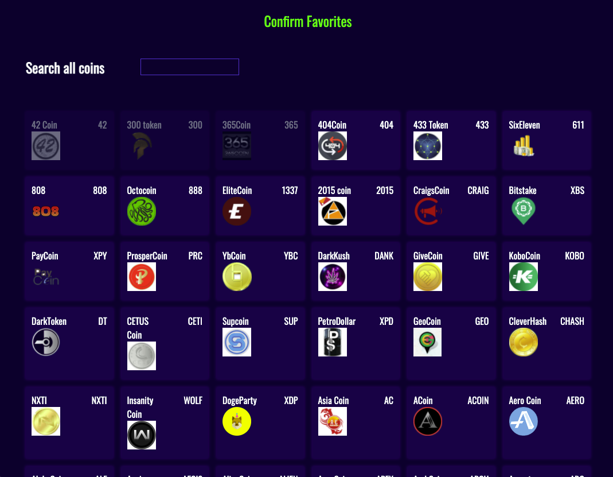

## 서론

가상화폐를 다루는 사이드 프로젝트를 하다가 사용자의 `Input` 을 받아 검색결과에 맞는 가상화폐들만 보여주어야 하는 Search Input 을 구현하고 있었다. 

해당 과정에서 사용자가 input 을 넣은 결과에 따라 output 을 도출해야 하지만, 사용자가 input 을 끝냈는지(마무리했는지) 에 대한 로직을 내가 직접 예측하기에는 무리라 생각이 들었다. 

그리하여 `onKeyUp` 을 활용하여 필터링을 하는 함수를 실행시키려 하였지만, 여기서 문제점은 사용자가 한글자를 타이핑 할때마다 해당 필터링 함수가 실행된다.

여끼까지는 문제점이 크게 없지만 만약 해당 필터링 함수가 `외부 유로 api` 로부터 data 를 fetching 해야하는 동작을 한다면? 각각의 query 는 즉 돈이기 때문에 매우 비효율적인 동작으로 보인다. 물론 위와같은 경우에는 한번만 fetching 한 후 `global state` 로 관리를 하면 된다만 위의 예시 이외에도 다양한 resource 의 낭비를 초래하는 이유들이 많다.

나는 이 문제를 해결하고자 `debounce`를 사용하였다.




---

## 본론

이벤트 발생과 그에따른 콜백함수를 다루는데 `debounce` 는 중요한 개념중의 하나라고 생각이 든다.

단순 클릭이벤트처럼 단순하지 않고, 검색폼처럼 사용자의 키보드 입력이 지속적으로 발생하면 처리를 하지 않으면 과도한 api 요청을 보낼 수 있고 이는 곧 서버의 과부화까지 이어질 수 있다.

위의 문제를 처리하기 위해 `debounce` 라는 개념을 사용하였다.

> debouncing 은 연속된 이벤트 중 마지막 이벤트의 콜백함수만을 실행한다.

리액트의 내장훅 중 하나인 `useEffect` 를 사용하여 직접 debouncing 을 구현하는 방법이 있지만, `lodash` 는 디바운싱을 사용하기 쉽게 만든 메소드가 존재하기에 이방식을 선택하였다.

```js
const filterCoins = (e, setFilteredCoins, coinList) => {
  let inputValue = e.target.value;
//   handleFilter(inputValue, coinList, setFilteredCoins);
    console.log(inputValue)
};

const Search = () => {
  return (
    <AppContext.Consumer>
      {({ setFilteredCoins, coinList }) => (
        <SearchGrid>
          <h2>Search all coins</h2>
          <SearchInput
            onKeyUp={(e) => filterCoins(e, setFilteredCoins, coinList)}
          />
        </SearchGrid>
      )}
    </AppContext.Consumer>
  );
};
```

위는 예시로 만든 debouncing 을 적용하지 않은 상태이며 만일 내가 'abc' 를 input 에 넣으면 콘솔에 'a', 'ab', 'abc' 즉 3번이 찍힌다.

```js
const handleFilter = _.debounce((inputValue, coinList, setFilterCoins) => {
  console.log(inputValue);
}, 500);

const filterCoins = (e, setFilteredCoins, coinList) => {
  let inputValue = e.target.value;
  handleFilter(inputValue, coinList, setFilteredCoins);
};
```

이를위해 debouncing 을 사요하는 `handleFilter` 함수를 추가로 만들어주었다. 결과적으로는 abc 를 타이핑하였을때 콘솔에 'abc' 한번만 찍히게 되었다.
 
---

## 결론

사용자의 input 에 따른 함수를 실행할 때, 특히 해당 함수가 유료 API를 사용한다면 쿼리를 무분별하게 날리기 때문에, 비용적인 문제를 초래할 수 있기에 이를 방지하기 위해 debouncing 을 사용할 수 있다. debouncing 은 연이은 이벤트의 마지막에만 실행할 수 있는 환경을 만들어 준다. 
