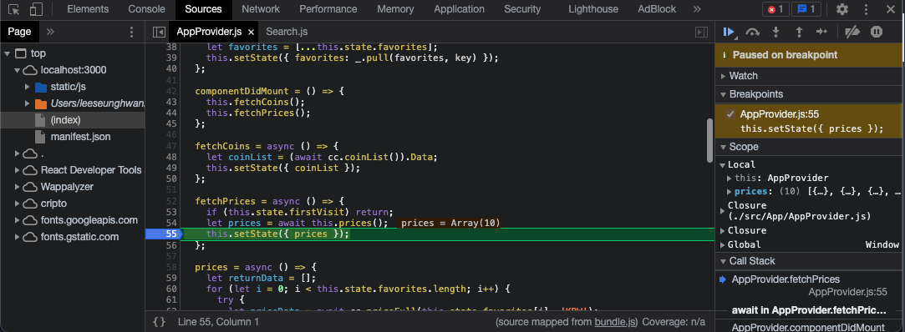

## 서론

외부 api 를 사용하는 상황에서 Docs 를 읽어본다 한들 실제 데이터의 형태가 어떻게 구성되어있는지 정확히 예상하고 코드를 짜는 행위는 불가능에 가깝다고 생각하고 에러를 유발한다. 나는 데이터 구성을 확인하기 위해 데이터 fetching 후 직접 콘솔로 찍어 확인하는 방법을 사용하였는데, 이는 차후에 코드의 에러를 유발할 수 있고, 자칫 까먹고 체크하는 코드를 없애는 행위를 까먹는 상황을 방지하기 위해 직접 콘솔을 찍기 보다는 `Chrome Dev Tool` 을 사용하여 `디버깅` 하는 방법을 채택하였다.

---

## 본론

`디버깅(debugging)` 은 스크립트 내 에러를 검출해 제거하는 일련의 과정을 의미한다. 모던 브라우저의 환경 대부분은 개발자 도구 내부에 UI 형태로 디버깅 툴을 가지고 있다. 디버깅 툴을 사용하면 실행 단계마다 어떤 일이 일어나는지를 코드 단위로 추적할 수 있다.

구글크롬에서 `F12` 를 누르면 `Chrome Dev Tool` 을 사용할 수 있다. 이후 탭에서 `Sources` 를 누르면 위와같은 화면이 보인다. 

Source 패널의 좌측은 `파일 탐색 영역` 으로 페이지에 쓰인 리소스를 트리 형태로 보여준다.

중앙은 `코드 에디터 영역` 으로 파일 탐색 영역에서 선택한 파일의 소스 코드를 보여준다.

우측은 `JS debugging` 영역으로 디버깅에 관련된 기능을 제공한다.

내가 서론에서 서술한 문제를 해결하기 위해 사용한 `breakpoint` 는 매우 중요한 개념이며 말 그대로 JS 의 실행이 중단되는 코드 내 지점을 의미한다. 중단점을 이용하면 실행이 중지된 시점에 변수가 어떤 값을 담고 있는지 알 수 있고, 중지된 시점을 기준으로 명령어를 실행할 수도 있다.

 위의 사진을 자세히 보면 나는 55번줄, 즉 외부 api 로부터 price 를 fetching 한 후 해당 값을 전역 state 에 할당하는 과정 바로 전에 데이터가 어떠한 형태로 들어왔는지 확인하기 위해 breakpoint 를 걸었다.

 우측에 `Scope` 항목에 실제로 prices 애 array 가 들어왔고 해당 데이터를 자세히 확인할 수 있게 되었다. 

---

## 결론

Chrome Dev Tool 에서 breakpoint 를 걸음으로서 스크립트 실행이 중지되면 중단 시점을 기준으로 변수에 어떤 값이 들어가 있는지 확인할 수 있다. 또한 단계별로 코드를 실행해 가며, 어디서 문제가 발생했는지 추적할 수도 있습다. 이런 식으로 디버깅을 진행할 수 있다.
