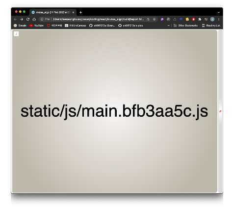
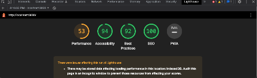
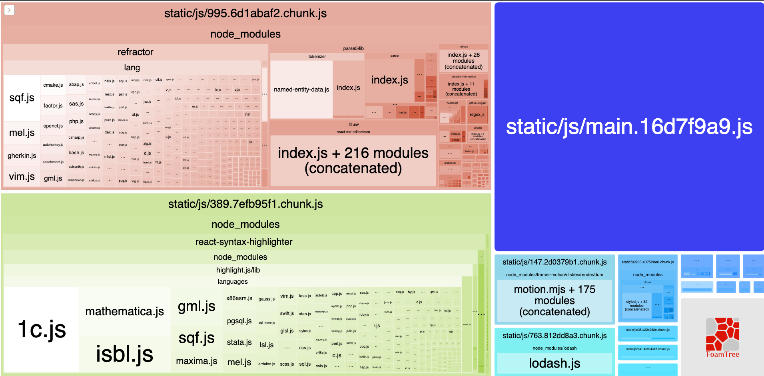
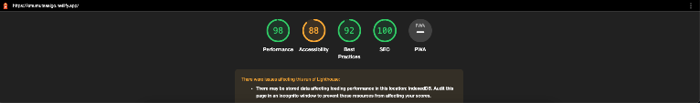

## 서론

아래의 링크에서 내가 왜 리액트같은 SPA 에서 `코드분할 (code-splitting)` 을 해야하는지에 대해 서술하였지만, 이번에는 내가 현재 진행하고 있는 프로젝트
내부에서 코드분할 전 후 를 비교하며 결과를 기록하려한다. 

https://hwani.dev/react-code-splitting/ 


---

## 본론

SPA (Single Page Application) 의 특성상 맨처음 페이지에 진입하게되면 웹팩에서 압축한 bundle file 을 다운받게 된다. 즉, 전체 리소스를 
`한번에` 다운받게 된다. 

이 개념이 이상적으로 보일 수 있으나, 결국 client (사용자) 는 전체 리소스의 bundle file 을 다운받기 전에는 화면을 볼수 없다는 뜻이기도 하다.
한국이나 인터넷 속도가 빠른 환경에서는 크게 문제점을 느낄수 없을지도 모르나, 인터넷 환경이 느릴경우에는 이와같은 방식은 사용자 경험을 저하시키는 요인이 될 수 있다.

이를 방지하기위해 `코드분할 (code-splitting)` 을 해준다. 코드분할이란 client (사용자) 에게 현재 불필요한 코드, 중복되는 코드 없이 적절한
사이즈의 코드가 적절한 타이밍에 `동적으로` 로드되도록 하는것이다.

이제 이 글을 읽는 독자를 위하여 실제 코드분할을 하면 어떠한 효과를 가져오는지 실 예시사례와 함께 보여주겠다.

### 개선 전

```js
import {
  Home,
  Solve,
  Problems,
} from './pages/index';

const App = () => {
  return (
    <Switch>
      <Route exact path="/">
        <Home />
      </Route>
      <Route exact path="/solve">
        <Solve />
      </Route>
      <Route exact path="/problems">
        <Problems />
      </Route>
    </Switch>
  )
}
```

물론 실제 진행하고 있는 프로젝트의 일부분만 가져왔지만 기본적으로 위와같이 컴포넌트를 상위컴포넌트인 `App.js` 에서 불러와 routing 처리를 하고있다.

이 경우에는 하나의 번들사이즈에 모든 페이지들이 포함되게 되며 번들 파일의 다운이 완료되기 전까지는 사용자는 실제 화면을 볼 수 없다.



해당 번들을 실제로 analyze 해봤을때 위와같은 `하나의` 거대한 chunk file 로 구성되어있고 이의 stat size 는 자그마치 `6.74MB` 를 차지하고 있었다.



또한 `light house` 를 돌려보았을때도 해당 이유로 인하여 퍼포먼스 점수가 53점으로 매우 낮게 평가되는 모습을 볼 수 있었다.

### 개선 후

```js
import { WaveLoading } from 'react-loadingg';
import { lazy, Suspense } from 'react';

const Home = lazy(() => import('./pages/Home/Home'));
const Solve = lazy(() => import('./pages/Solve/Solve'));
const Problems = lazy(() => import('./pages/Problems/Problems'));

const App = () => {
  return (
    <Suspense fallback={<WaveLoading />}>
        <Switch>
          <Route exact path="/">
            <Home />
          </Route>
          <Route exact path="/solve">
            <Solve />
          </Route>
          <Route exact path="/problems">
            <Problems />
          </Route>
        </Switch>
    </Suspense>
  )
}
```

위와같이 `lazy` 와 `Suspense` 를 사용하여 코드분할을 통해 번들을 쪼개어 사용자가 필요한 시점에 동적으로 다운을 받게 리팩토링을 해주었다.



위와같이 초기 필요한 번들의 사이즈는 물론 개선이 필요하지만 `2.1MB` 로 감소되었고 사용자의 액션에 따라 동적으로 필요한 코드를 다운로드 받게 된다.



물론 `lazy`와 `Suspense` 를 사용함으로써 `render-blocking` 요소를 사용함에 따라 접근성 점수는 저하되었지만, 퍼포먼스 점수는 전과 비교하면 매우 큰 
폭으로 향샹되었다.

해당 점수의 폭만 봐도 이정도의 노력만 들이더라도 전반적인 퍼포먼스를 대폭 늘릴 수 있다면 `코드 분할` 을 사용해야할 이유는 충분하지 않을까 생각한다.

---

## 결론

`코드 분할 (code-splitting)` 은 단순 "지연시간동안 사용자에게 로딩화면을 보여준다" 라는 이유 이외로도 실제 SPA 의 성능 향상에 대폭 영향을 끼친다.


