## 서론

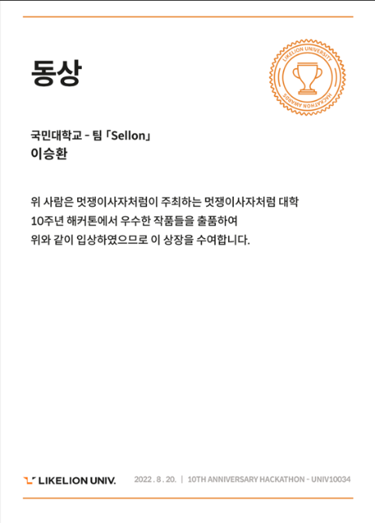

멋쟁이 사자처럼 10기 전체 해커톤에서 우리학교 팀원들과 `Sellon` 이라는 물물경매 플랫폼으로 약 900명 / 150팀 중 `동상` 이라는 좋은 성적을 받게 되었다. 

깃헙 링크: https://github.com/bunderLikeLion

하지만 해커톤의 특성상 짧은 시간내로 `product`를 만들어야 했었고, 개발 과정에서 놓치고 지나간 부분이 꽤나 많다는 부분을 인지하고 있었음에도 불구하고
시간상의 문제로 인하여 선뜻 오로지 `성능 개선` 이라는 하나의 목표를 위해 충분한 시간을 투자할 수 없었다. 본고에서는 product 개발 과정에서 무엇을 중요시 하였으며, 해커톤이 끝난 후에 문제점을 파악하여 
가능하다면 해결책 까지 찾는 과정을 다룰 예정이다.


---

## 본론

### 1. 전체 구조 (structure)

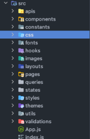

나름 고민하며 지속적인 `restructuring` 을 거친 구조이다. 모두가 알만한 디렉토리를 제외하고 설명이 필요한 부분만 다룰 예정이다.

#### - pages - 

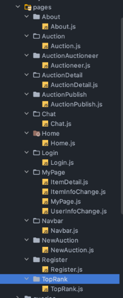

`Navbar.js` 를 제외하고는 실질적인 `router`를 통해 개별의 주소를 가지는 거대한 `page component` 들이다. 

#### - components - 

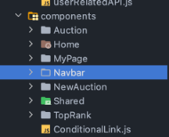

각 `page` 별로 들어가는 세세한 `component` 들이 들어있는 `directory` 이다. 간단한 구조의 page나 시간상 쪼개기 힘들었던 page들에 대한 세세한 컴포넌트들은 
포함되지 않는 경우도 있다. 특이점은 `Shared` 디렉토리이다.  

```js
const ValidationModal = ({
  handleModal,
  isModalOpened,
  mainText,
  subText,
  btnText,
  relatedId,
  type,
}) => {
  const { mutate: allInFunc } = useAllInAuctionItemMutation(relatedId);
  const { mutate: endDealingFuc } = useEndDealingMutation(relatedId);

  const clickBtnFunc = () => {
    if (type === 'allIn') {
      allInFunc();
    } else if (type === 'endDealing') {
      endDealingFuc();
    }
    handleModal();
  };

  return (
    <Modal
      open={isModalOpened}
      onClose={handleModal}
      aria-labelledby="modal-modal-title"
      aria-describedby="modal-modal-description"
    >
      <ModalContainer>
        <Text>{mainText}</Text>
        {subText && <SubText>{subText}</SubText>}
        <ButtonContainer>
          <ValidationButton onClick={clickBtnFunc}>{btnText}</ValidationButton>
          <ValidationCancelButton onClick={handleModal}>
            취소
          </ValidationCancelButton>
        </ButtonContainer>
      </ModalContainer>
    </Modal>
  );
};

export default ValidationModal;
```

위는 `ValidationModal` 즉, 확인을 받는 모달에 대한 `component`인데 이는 범용성이 넓고 매 상황에 직접 짜기에는 코드의 반복이 너무 많다고 판단되어 `props` 를 받아
`customizing` 이 가능한 `재사용` 성이 있는 `component` 들을 모아놓은 디렉토리이다. 


#### - hooks -

이는 반복되는 기본적인 리액트 로직의 코드 중복을 방지하고자 `input` 을 받는 로직 등 편의성을 위해 만든 `custom hook` 들이 들어있는 디렉토리이다. 아래의 예시와 같다.

```js
const useInput = (initialValue = null) => {
  const [value, setValue] = useState(initialValue);
  const handler = useCallback((e) => {
    setValue(e.target.value);
  }, []);
  const reset = useCallback(() => {
    setValue('');
  }, []);
  return [value, handler, reset, setValue];
};

export default useInput;
```

#### - apis -

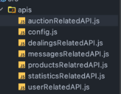

큰 기능별로 분류해놓은 `api` 주소이다. 이후에 설명할 `react-query` 문을 따라 결국에 최종적으로 `request`를 보내고 `response`를 받는 파일들이 모여있다.
단순 요청과 응답 이외에도 `pagination handling` 등 많은 일들이 일어난다.

#### - queries  -

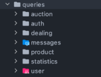

위에서 다뤘던 `apis` 디렉토리이는 정말 최종적인 `req` & `res` 다루는 종단점일뿐, 실제 `Sellon` 에서의 실질적인 요청과 응답은 `queries`에서 이루어진다.
`react-query` 를 지속적으로 사용하였으며, 정말 복잡하고 많은 파일들이 있지만, 간단한 경매를 가져오는 쿼리를 예시로 들어보자

```js
const useAuctionsQuery = (
  sort,
  pageNum,
  cat,
  filterKeyword,
  dealingType,
  showAll
) => {
  return useQuery(
    ['auctionList', sort, pageNum, cat, filterKeyword, dealingType, showAll],
    () =>
      auctionRelatedAPI.getAuctionLists(
        sort,
        pageNum,
        cat,
        filterKeyword,
        dealingType,
        showAll
      ),
    {
      onError: (res) => {
        toast.dismiss();
        toast.error(errorMsgHandler(res));
      },
    }
  );
};

export default useAuctionsQuery;
```

위와같이 여러 요소들을 `parameter` 로 받아 지정된 `api address` 로 요청을 보내고 `response` 를 실제 해당 쿼리를 호출한 `component`에 전달한다.

#### - states - 


`states` 는 `client 상태` 를 다루는 디렉토리이며 주로 `recoil`을 사용하였으며, `user` 정보를 다루는데 주로 사용하였다.


--- 

### 2. 그래서 왜 Recoil? 왜 React-query?

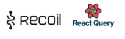

프로젝트를 시작하기전 최우선적으로 고려할 사항들이 있었다. 

- 생각보다 기획단계에서의 `product volume` 에 비해 시간이 부족하였다.
- 대부분이 `react`를 처음으로 사용하는 인원들로 팀이 구성되어 있었다. 

이에 따라 나는 `boiler-plate` 도 너무 방대하고 러닝커브가 존재하는 `redux` 를 과감히 배제하기로 초반에 결정하였다. 그렇다면 이후의 선택지가 기본 `react` 에
내장되어있는 상태관리를 용이하게 해주는 기능인 `Context api` 와 개인적으로 초반에 배우기 쉽다고 생각하는 상태관리 `third-party-library` 인 `zustand` 가 머릿속에 
떠올랐으나, 과연 관리해야할 상태가 많다고 판단되는 프로젝트에서 과연 이런식으로 땜빵(?) 하는게 맞나 생각이 들었다.

이후 몇달전에 `우아한 세미나` 에서 봤던 간단한 `상태관리 library + react-query` 의 조합이 머릿속에서 떠올랐다. 당시에는 잘 이해도 안가고 관심도 딱히 없었으나 그래도 혹시몰라 
공식문서를 뒤져보며 효율성을 따져보기 시작하였다. 처음 `react-query` 공식문서를 쭉 읽어보았을때 왜 사람들이 `react-query` 는 `server state management` 에 특화된 라이브러리라고
말했는지 이해가 가기 시작했다. 그중에 `읽기(R)` 를 담당하는 `useQuery` 와 `생성(C), 수정(U), 삭제(D)` 를 담당하는 `mutation` 이 나누어져있기에 굉장히 직관적이며 잘 만들어져있다고 생각이 들었다.
또한, `response` 에 대한 `handling` 도 가능하고 한번 `fetching` 한 데이터에 대해서는 `refetching process` 없이 해당 데이터를 다시 사용 할 수도 있고, `카테고리 불러오기` 같이 
주지적인 데이터의 변화가 없는 상황에 대해 `staleTime` 을 사용하여 얼마동안 한번 받아온 데이터(`fresh`) 를 `refetching` 없이 유지할 수 있다는 점이 매력적이였다.

`react-query` 를 채택하고 실제 사용한 이유요소는 추가적으로 많지만, 이는 다른 글에서 깊게 다뤄보기로 하고, 서버에서 받아오는 데이터는 `react-query` 를 사용하면 되지만, 실제 `client state`, 예를들어
`사용자 정보`, `lightMode/darkMode` 과 같은 상태를 관리할 수단이 필요했다. 여기서도 `Context-api` 를 떠올렸지만, 처음 `react` 를 사용하는 팀원들이 실질적으로 사용하기에는 
내가 `boiler-plate` 와 `상태 저장` 에 대한 로직만 내가 짜놓은 후 사용하는 방식만 가르쳐준다면 오히려 `recoil` 이 사용하기 편하다고 생각하여 `client-state` 를 `react-query` 로 관리하고, 
`server-state` 를 `react-query`로 관리하기로 최종 결정하였다.

---

### 3. 프로젝트 이후 다시 코드를 보다

정신없이 해커톤을 마무리한 후 이틀정도를 쉰 후 다시 책상에 앉아 코드를 까보았다. 당시에 느낀점은 생각보다 코드를 더럽게 짰다, 그리고 생각보다 화면 렌더링 시간이 오래걸린다 
였다. 첫번째 이슈는 즉시 해결이 가능했지만, 렌더링 시간은 분석이 필요한 상황이였다.

--- 

### 4. 처참한 Lighthouse 결과 

무엇이 문제였을까? 라는 생각을 하며 혹시모를 기대감에 `Lighthouse` 로 우리의 product 를 측정해 보았다.

하지만 아래의 사진과 같이 정말 처참한 결과값을 확인할 수 있었다. 내 자신에 대해 매우 큰 실망을 하였고 지금이라도 코드를 갈아엎는 한이 있더라고 무조건적으로 성능 개선을 하고 
싶다는 생각이 들었다.

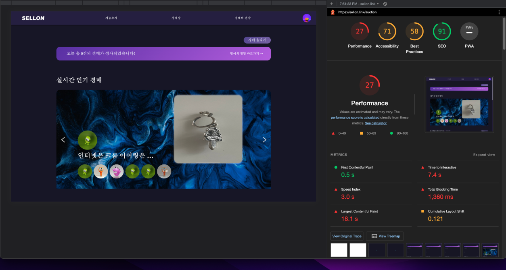

우리 서비스의 특성상 매우 많은 사진들이 등록되고 보여주게 된다. 이 과정에서 유저가 사진을 올릴때 사이즈를 조정할 수 있는 별도의 툴을 제공하지 않았고, 사진을 받아 DB 에 바로 저장 후 
해당 사진에 대한 `imgUrl` 받았을 때 어떻게든 우리의 박스에 우겨넣곤 하였다. 이로인해, 투머치할 정도로 사진들의 사이즈가 너무 컸고, 이로인해 퍼포먼스 저하에 직접적인 제일 큰 요인이 되었다.

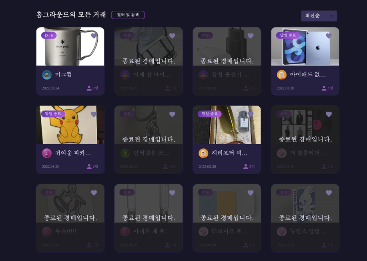

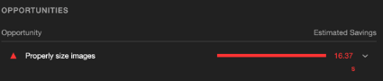

실제로 하나의 이미지를 예로 들어보자면 맥북 기준 보여주어야 할 image content 의 사이즈는 `226 x 168` 이지만, 실제 사이즈의 사진의 크기는 `569 x 832` 였다.

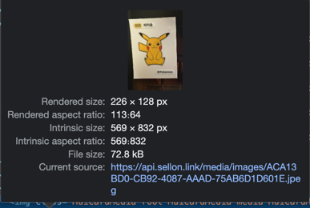

만약 보여주어야 하는 이미지의 박스 크기가 120x120 이라면, 그에 상응하는 이미지 사이즈를 렌더링하는 것이 효과적이나, 레티나 디스플레이의 등장으로 인해 2배인 240x240 정도를 가져오는 것으로 
자리잡는 추세이다. 현재 우리의 서비스는 `server` 로부터 `image url` 을 받아 렌더링 하고 있으며, 대회가 끝난 상황에서 백앤드 팀원들과 다시 전체적 프로젝트 리팩토링을 하기에는 
무리가 있다 판단되어 내가 방법을 찾아보기로 하였다.

--- 

5. 이틀간의 시도


이틀간 굉장히 많이 구글링을 하고 방안을 모색해보았다, `imgix` 라는 `img cdn` 을 사용하는 방안에 제일 시간을 많이 쏟았다. `imgix` 는 `imgUrl` 을 전송 후 내가 지정한 
사이즈를 가진 `img` 를 받을 수 있는 서비스라고 이해했지만, 아무리 이를 사용하여 시도를 해보아도, 왜인지는 모르겠지만 결국 `img size` 는 최적화 하는데 실패하였다.

시도해본 다른 방안은 `jpg` 나 `png` format 으로 으로 이루어진 사진을 `webp` 로 전환하여 렌더링 해준다는 라이브러리를 찾아 이를 적용해 보았지만, 결국 에러만 잔뜩 날뿐, 
실제 효과를 보지 못하였다.

결국 `imgix` 를 다시 사용하는 방식으로 시도해 보았지만, 도중에 과연 기업들은 어떻게 할까? 에 대해 찾아보기 시작하였다. 찾은 답변들의 공통점은 `imgix` 처럼 사이즈를 변환하는
자체적인 루트를 만들거나 애초에 `img` 를 저장하는 방식에서 `thumbnail` 에 대한 `resizing` 이 들어간 가벼운 사진을 `db` 에 별도로 저장한다는 점이였다. 또한 
`webp` 에 대한 사용성도 이전보다 많이 늘어난 추세였으며 이를 적절하게 사용한다면 렌더링 속도도 매우매우 늘어날 것이라는 예측도 하게 되었다. 그리하여 나는 현재 상황에서
이를 해결하기에 어려움이 많다고 생각하여 접어두게 되었다.

해당 문제는 아쉽게 해결하지 못하였지만, 이후 프로젝트를 또 진행한다면 무작정 이러한 서비스를 만들것이고 빨리 개발을 해야해 라는 마음가짐보다는 실제 `최적화` 에 대한 요소를 
무조건적으로 고려하며 개발을 진행해야한다는 사실을 뼈져리게 느꼈다.


---

## 결론

좋은 팀원들을 만나 나름 웃으면서 재밌게 개발을 할 수 있었고, 배운점도 많았기에 만족할 수 있었던 프로젝트였다. 이후 꼭 최적화를 계속 생각하며 개발을 해야한다는 교훈을 
뼈져리게 느끼기도 하였고 branch 전략을 세워 개발 중간중간 PR code review 를 진행하며 나름 협업에 대한 개념도 어느정도 머릿속에 들어온 것 같다. 다음 글에서는 
내가 `react-query` 에서 주목한 핵심 개념은 무엇이었으며, 나는 어떻게 사용했는가에 대해 글을 적을 예정이다.


