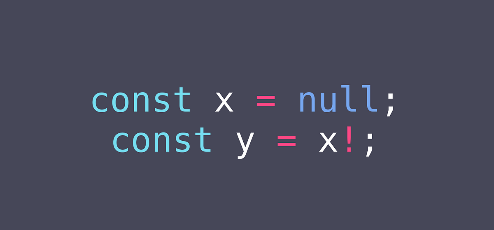
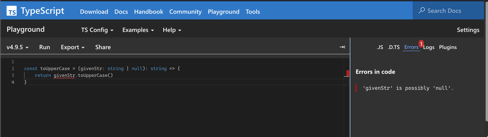
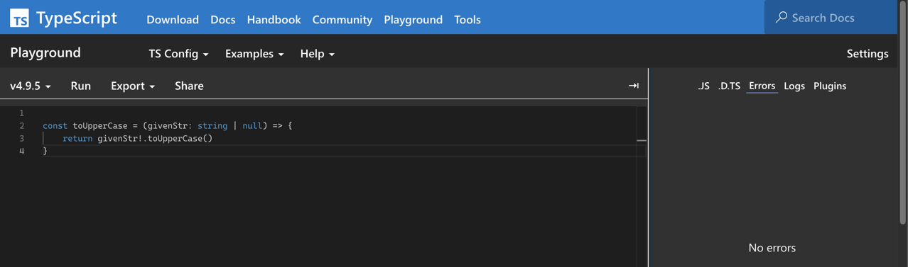

## Intro

타입스크립트에서 접미에 붙는 `느낌표 (!)` 는 non-null 단언 연산자라 불리웁니다. 만일 타입스크립트 컴파일러가 값이 `null`  혹은 `undefined` 일수도 있다하며 불평한다면 단순히 뒤에  `!` 를 붙이며, 이 값은 
`null` 혹은 `undefined` 가 될수없다 말하시면 깔끔하게 해결 가능합니다.

(라고 말하면 이 글을 당장 끄시는 분들이 많겠죠? 장난입니다. 🫠) 



---

## Main

### 1️⃣ non-null assertion operator (!) 란?

non-null 단언 연산자란 `typescript type checker` 에게 적용된 피연산자가 `null` 이나 `undefined` 가 아니다! 라고 단언하게 해주는 연산자입니다.

예시를 보며 살펴봅시다. 
`문자열` 을 인자로 받아 대문자로 변환하여 반환하는 함수를 만든다 가정하면 아래 결과와 같이 typescript type checker 는

> 'givenStr' is possibly 'null'.

라며 빨간줄과 함께 불평을 하기 시작합니다.

```ts
const toUpperCase = (givenStr: string | null) => {
    return givenStr.toUpperCase()
}
```



이는 `toUpperCase()` 메서드가 자바스크립트의 `String` 객체의 내장 메서드이기에 `null || undefined` 값에는 사용할 수 없기 때문입니다.

그렇다면 `non-null assertion operator` 를 사용하여 `givenStr` 은 `null` 이나 `undefined` 가 아닙니다! 라고 단언한다면 어떻게 될까요?


```ts
const toUpperCase = (givenStr: string | null) => {
    return givenStr!.toUpperCase()
}
```



우선적으로 typescript type checker 의 불평을 잠재웠지만, 과연 바람직한 결과일까요? 정말 인자로 `null | undefined` 값이 들어가지 않을 것이라고 확신할 수 있나요?

### 2️⃣ 대안

코드는 길어질 수 있더라도 아래와 같이 `type guard` 를 통해 인자로 `null` 이 들어올 수 있는 상황에 대비할 수 있고, type checker 의 불평또한 해소할 수 있습니다.

```ts
const toUpperCase = (givenStr: string | null) => {
  if (givenStr === null) return null;
  return givenStr.toUpperCase();
};
```

또한 다른 방식으로 `nullish coalescing operator(??)` 를 사용할 수도 있습니다.

```ts
const toUpperCase = (givenStr: string | null) => {
  return givenStr ?? null?.toUpperCase();
};
```

다른 방식으로는 Error 를 발생시키는 방법 또한 존재합니다.

```ts
const toUpperCase = (givenStr: string | null) => {
  if (givenStr === null) {
   throw new Error('unexpected err: givenStr not present') 
  }
  return givenStr.toUpperCase();
};
```


---

## Wrapping Up

typescript 2.0 에서 공개된 `non-null assertion operator(!)` 는 타입스크립트의 type checking system 을 무시하고 느슨한 타입체킹을 유도하기에 정말 어쩔 수 없을떄만 사용해야 하지 않을까? 라는 생각을 했습니다.

---

## References

- https://www.typescriptlang.org/docs/handbook/release-notes/typescript-2-0.html
- https://github.com/typescript-eslint/typescript-eslint/blob/v2.34.0/packages/eslint-plugin/docs/rules/no-non-null-assertion.md
