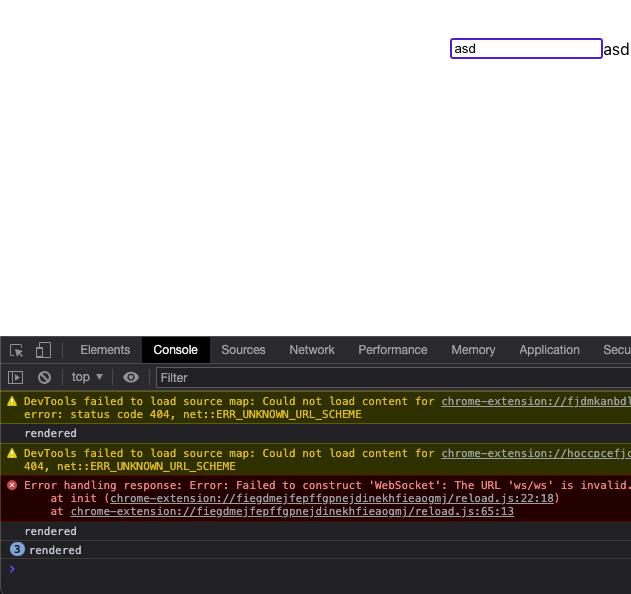
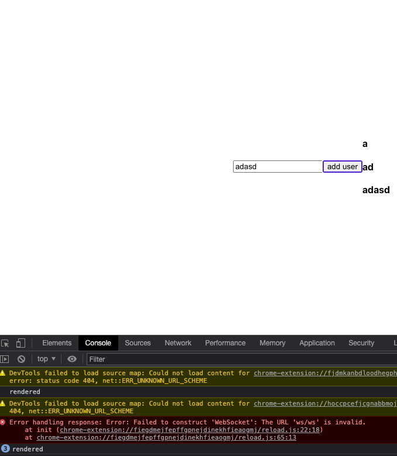

## 서론

Javascript 를 사용할때, 특정 DOM 을 선택하여 정보를 얻거나 임의로 조작해야 할때, `getElementById` 혹은 `querySelector` 과 같은 DOM Selector 함수를 사용하여 DOM 을 선택하였다. 하지만, React 는 이 기능을 대체할 수 있는 `useRef` 훅을 제공한다.

---

## 본론

> useRef는 .current 프로퍼티로 전달된 인자(initialValue)로 초기화된 변경 가능한 ref 객체를 반환합니다. 반환된 객체는 컴포넌트의 전 생애주기를 통해 유지될 것입니다. 본질적으로 useRef는 .current 프로퍼티에 변경 가능한 값을 담고 있는 상자와 같습니다.

리액트 공식문서에는 위와 같이 나와있고, 결국 나는 useRef 는 특정 DOM node 와 변수 자체를 담을 수 있는 상자라고 해석했다.

그렇다면 왜 기존에 vanilla JS 에서 사용하던 친숙한 `querySelector` 를 지양하고 이를 대체하는 `useRef` 를 사용할까? 에 대해 검색을 해보았다.

내가 해석한 결론은 React에서 `querySelector` 를 사용하게되면, 실제 DOM의 요소를 가져오게 된다. 하지만 React는 Virtual DOM을 통해 Real DOM을 그리기 때문에, React가 제어하고있는 Virtual DOM 안에 있는 요소가 더 신뢰할만하다. DOM API로 Real DOM에 있는 node 를 담았지만, 이게 현재 Virtual DOM을 통해 Real DOM에 존재하는 node 인지 아닌지 확신할 수 없다는 점이 크리티컬 하다고 생각한다.

또한, React를 사용하게되면, 가장 중요한 개념 중 하나가 `State` 이다. React 내부에서 데이터는 컴포넌트 내의 State으로 조작된다. 즉, React가 State를 컨트롤(제어)하고 있다. 만약 이러한 React 시스템을 벗어나 DOM을 직접적으로 건드리게되면 이 내용들은 React가 제어하는 영역에서 벗어나게 되고, 이렇게 React의 제어를 벗어나게 되면, React에서 제공하는 이점들을 사용할 수 없게 된다.

위에서 `useRef` 를 사용 이유에 대해 알아보았다면, 내가 생각하기에 `useRef` 의 이점은 `무분별한 react component 의 re-rendering 을 방지한다` 이다.

React 내에서 `re-rendering` 은 컴포넌트가 자신의 `state` 가 변경되거나, 부모에게서 받는 `props` 가 변경될 때마다
컴포넌트를 다시 호출하여 실행하는 현상을 말한다. re-rendering 시에 컴포넌트 내부의 state 과 function 또한 `재선언` 이
이루어지기에, 무분별한 re-rendering은 결국 resource 낭비라고 생각이 든다.

결국 `useRef` 가 어떻게 `무분별한 re-rendering` 을 방지하는가에 대해서는 useRef 가 담을 수 있는 변수에 답이 있다.
이는 독단적인 `변수` 그 자체이기에, 값이 바뀐다고 해도 컴포넌트가 re-rendering 되는 트리거로 작동하지 않는다.

```js
import "./App.css"
import { useState } from "react"

function App() {
  const [username, setUsername] = useState("")
  const handleChange = e => {
    setUsername(e.target.value)
    console.log(username)
  }

  console.log("rendered")

  return (
    <div className="box">
      <input type="text" onChange={handleChange} />
      {username}
    </div>
  )
}

export default App
```

위의 예시는 컴포넌트의 re-rendering 을 감지하기 위해 예시로 짠 코드이다. `console.log('rendered')` 로 인하여
컴포넌트가 초기에 렌더링될때 한번 콘솔에 찍히고, re-rendering 될때마다 매번 rendered 가 찍히게 된다.
또한, input 에 넣는 값에따라 handleChange 함수로 인하여 username 의 state 를 변경하게 된다. 즉, 값이 변경될 때마다
state 가 변하게 되고 이는 즉, re-rendering 을 일으킨다는 것이다.



위와같이 테스트 결과 state 이 변할때마다 re-rendering 이 일어났다.

```js
import "./App.css"
import { useRef, useState } from "react"
import React from "react"

function App() {
  const inputRef = useRef(0)
  const [user, setUser] = useState([])

  const addUser = () => {
    setUser([...user, { name: inputRef.current.value }])
  }

  console.log("rendered")

  return (
    <div className="box">
      <input type="text" ref={inputRef} />
      <button onClick={addUser}>add user</button>
      <div>
        {user.map((user, idx) => {
          return <h4 key={idx}>{user.name}</h4>
        })}
      </div>
    </div>
  )
}

export default App
```

이를 위해 위와 같이 `useRef` 를 사용하는 방식으로 리팩토링 해보았고, 직접 값을 추출하여 유저를 추가 및, `map()` 을
사용하여 화면에 유저들을 띄우는 코드로 바꾸었다.



테스트 결과, 처음 렌더링 될때 한번, 3명의 유저를 추가하였을때 각각 한번씩, 총합 4번의 'rendered' 콘솔이 찍혔다.

---

## 결론

리액트는 `virtual DOM` 을 사용하기 때문에 특정 DOM 을 선택할때 Vanilla JS 에서 사용하던 방식인 `querySelector`
를 사용하는 방식을 지양해야 한다. 이를 대체하기 위해 `useRef` 를 사용하게 되는데, 개념은 비슷하지만 내부에 따로 변수또한
담을 수 있고, 이를 유용하게 사용할 수 있다.
